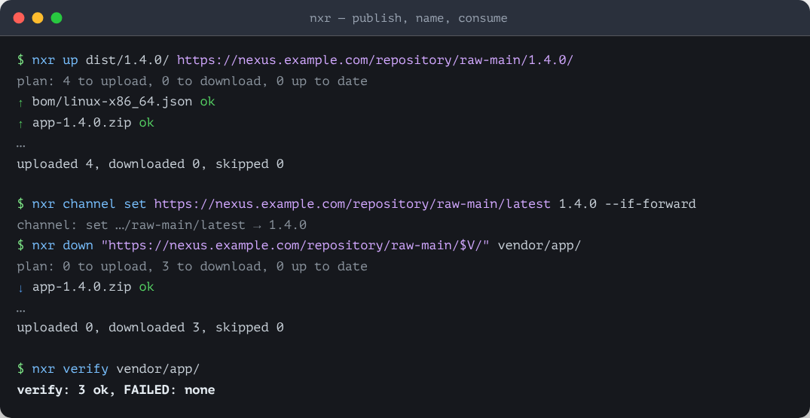

# nexus-raw

<p align="center"></p>

<p align="center">
  
</p>

> `nxr` is curl for a Sonatype Nexus raw repository.

One static binary: curl-grade primitives with retries, stall detection and TLS on, verified directory transfers with sha-sibling markers on top, channel refs and manifests above those.
Every call is self-sufficient: URL in argv, credentials from `-u` or the environment, no config file, no profiles, zero server-side components.
The `nexus-raw-core` crate exposes the same operations as a Rust library.

## Install

```bash
cargo install --path crates/nexus-raw    # the nxr binary
```

## Quick start

Two flows cover the model. Publish a version and name it, then fetch it back and check it offline:

```bash
BASE=https://nexus.example.com/repository/raw-main

# list what consumers may fetch: down refuses a version without this file
printf '{"artifacts": ["app-1.4.0.zip"]}\n' > dist/1.4.0/manifest.json

# publish a version directory: markers are generated, verified and uploaded by default
nxr up dist/1.4.0/ "$BASE/1.4.0/"

# name it — a channel is a token file at any name
nxr channel set "$BASE/latest" 1.4.0 --if-forward

# fetch it elsewhere: the channel names the version, the manifest lists the files
V=$(nxr channel get "$BASE/latest")
nxr down "$BASE/$V/" vendor/prebuilt
nxr verify vendor/prebuilt
```

An interrupted transfer is finished by repeating the same command: `up` skips what is already complete, `down` resumes from part files through `Range: bytes=N-` by default, and `--fresh` starts over.
The rest of the model (explicit enumeration, dry-run plans, best-effort listings) is in the [command table](#commands) and the [docs](docs/index.md).

## Integrate it

Three depths, one contract: shell out to `nxr`, embed `nexus-raw-core` in Rust, or call the Node bindings.
The guide with the install lines, the snippet and the vendoring rules: [docs/how-to/integrate.md](docs/how-to/integrate.md).

## Credentials

Three sources, tried in this order: `-u user:pass`, then `NXR_AUTH`, then `NXR_USERNAME` + `NXR_PASSWORD`.
That is the whole list: the alias and the default URL live in your shell or CI instead of a config file.

```bash
# the simple way: two variables, nothing encoded
export NXR_USERNAME="my-login"
export NXR_PASSWORD="my-password"

# the CI way: one value instead of two, handy for a masked variable
export NXR_AUTH="$(printf '%s:%s' 'my-login' 'my-password' | base64)"
# NXR_AUTH holds base64 of "my-login:my-password", here: bXktbG9naW46bXktcGFzc3dvcmQ=
```

`-u` is the fastest for a one-off and is visible in `ps`.
Not sure which source resolved? `nxr doctor` names it without printing values.

## Features

- `get`, `put`, `head`, `sha`: curl-grade primitives, digest computed on the fly.
- `up`, `down`: directory transfers with the symmetric diff, parallel workers and Range-resume on by default (`.part` files, 206), `--fresh` starts over.
- sha-sibling markers: every uploaded object gets a `<name>.sha256` sidecar in `sha256sum -c` format, `up` writes and generates them by default, `--no-sha` opts out.
- `down` enumerates explicitly: `manifest.json` at the version URL, `--manifest`, repeatable `--name`, or best-effort `--ls`.
- `channel get|set`: token files at any name, with a dotted-numeric `--if-forward` guard.
- `verify`: offline check of bytes, markers and digests.
- `doctor`: credentials, TLS, reachability.
- TLS verification on by default, `--tls-insecure` is the only off-switch.
- `--json`: one JSON object for simple commands, NDJSON events for transfers.
- Exit codes 0/1/2/3, and every error prints a `hint:` line on stderr.

## Commands

| Command | Does |
|:--------|:-----|
| `nxr get <URL> [-o FILE] [--continue]` | GET to a file (via `.part`, resume through Range) or stdout |
| `nxr put <URL> -f FILE [--sha]` | PUT bytes: `--sha` also PUTs the `.sha256` sibling |
| `nxr head <URL>` | status, size, content type |
| `nxr sha <FILE\|URL>` | streaming sha256 of a file or a remote object |
| `nxr up <SRC_DIR> <DST_URL> [--manifest F] [--no-sha] [--dry-run] [--claim-first NAME]` | scan → diff → PUT bytes + markers in parallel workers, `--manifest F` restricts the run to the names listed in F |
| `nxr down <SRC_URL> <DST_DIR> [--manifest F\|URL\|-] [--name N]... [--ls] [--fresh]` | enumerate → diff → stream+hash → rename + local marker |
| `nxr ls <URL> [--assets]` | version or object listing through the search API (experimental) |
| `nxr channel get <URL>` | print a channel token (`unset` when empty) |
| `nxr channel set <URL> <TOKEN> [--if-forward]` | write a token, forward-only in dotted-numeric order on guard |
| `nxr verify <DIR> [--manifest F\|-]` | local bytes + marker + digest only, no network |
| `nxr doctor [URL]` | credentials, TLS, settings, reachability |

Exit codes: 0 ok, 1 data (`mismatch`, `incomplete`, `missing`, `cannot enumerate`), 2 misuse, 3 transport (network, auth, TLS, 5xx).
A divergent complete artifact is refused, never overwritten.

## Layout

| Path | For |
|:-----|:----|
| `crates/nexus-raw-core/` | the Rust library, in four layers: `transport` + `primitive`, `sync`, `layout`, and the `Nxr` facade |
| `crates/nexus-raw/` | the `nxr` binary: flags, rendering and exit codes only, no protocol logic |
| `crates/mock-nexus/` | the mock server with the failure-scenario table, the conformance fixture |
| `docs/` + `mkdocs.yml` | the documentation site (zensical), served by `just docs` |
| `node/` | future home of the npm packaging, which does not exist yet |

## Development

```bash
just check        # fmt + clippy + prek + tests
just test         # unit and conformance suites
just mock atomic --port 8080
just nxr -- up dist/1.4.0/ http://127.0.0.1:8080/1.4.0/
```

User documentation lives in [docs/](docs/index.md) and renders as a site:

```bash
just docs     # http://localhost:8000, live reload
```

The Russian readme: [README.ru.md](README.ru.md).
