<div align="center">

<a href="https://lipen.github.io/nexus-raw/how-to/demo/">

</a>

# nexus-raw

`nxr` работает как curl для raw-репозитория Sonatype Nexus.

[](https://github.com/Lipen/nexus-raw/actions/workflows/ci.yml)
[](https://github.com/Lipen/nexus-raw/actions/workflows/docs.yml)
[](https://crates.io/crates/nexus-raw)
[](https://www.npmjs.com/package/nexus-raw)

[Документация](https://lipen.github.io/nexus-raw/) · [Установка](#установка) · [Быстрый старт](#быстрый-старт) · [Команды](#команды) · [README in English](README.md)

</div>

## Установка

Готовые бинарники лежат в [GitHub Releases](https://github.com/Lipen/nexus-raw/releases/latest), контрольные суммы в [`SHA256SUMS`](https://github.com/Lipen/nexus-raw/releases/latest/download/SHA256SUMS):

| Файл | Платформа |
|:-----|:----------|
| [`nxr-linux-x64.tar.gz`](https://github.com/Lipen/nexus-raw/releases/latest/download/nxr-linux-x64.tar.gz) | Linux x86_64, статическая сборка |
| [`nxr-linux-aarch64.tar.gz`](https://github.com/Lipen/nexus-raw/releases/latest/download/nxr-linux-aarch64.tar.gz) | Linux arm64, статическая сборка |
| [`nxr-darwin-x64.tar.gz`](https://github.com/Lipen/nexus-raw/releases/latest/download/nxr-darwin-x64.tar.gz) | macOS Intel |
| [`nxr-darwin-arm64.tar.gz`](https://github.com/Lipen/nexus-raw/releases/latest/download/nxr-darwin-arm64.tar.gz) | macOS Apple silicon |
| [`nxr-windows-x64.tar.gz`](https://github.com/Lipen/nexus-raw/releases/latest/download/nxr-windows-x64.tar.gz) | Windows x86_64 |

Те же архивы умеет забирать `cargo binstall`:

```bash
cargo binstall nexus-raw
```

Из npm, нативный аддон ставится готовым пакетом:

```bash
npm install nexus-raw
```

Из crates.io:

```bash
cargo install nexus-raw
```

Из репозитория:

```bash
cargo install --git https://github.com/Lipen/nexus-raw nexus-raw --locked
```

Из checkout:

```bash
cargo install --path crates/nexus-raw --locked
```

Варианты через cargo собирают из исходников, поэтому нужен Rust 1.88 или новее.
Проверить установку: `nxr --version`.

## Быстрый старт

От каталога с файлами до проверенной локальной копии:

```bash
BASE=https://nexus.example.com/repository/raw-main

# down нужен перечень имён: manifest.json его и даёт
printf '{"artifacts": ["app-1.4.0.zip"]}\n' > dist/1.4.0/manifest.json
nxr up dist/1.4.0/ "$BASE/1.4.0/"
nxr channel set "$BASE/latest" 1.4.0 --if-forward
V=$(nxr channel get "$BASE/latest")
nxr down "$BASE/$V/" vendor/prebuilt
nxr verify vendor/prebuilt
```

Если передача прервалась, запустите ту же команду снова: уже полученное пропускается, остальное скачивается дальше.

## Команды

| Команда | Делает |
|:--------|:-------|
| `nxr get <URL> [-o FILE] [--continue]` | GET в файл (через `.part`, докачка через Range) или stdout |
| `nxr put <URL> -f FILE [--sha]` | PUT байтов, с `--sha` ещё и `.sha256`-маркер |
| `nxr head <URL>` | статус, размер, content type |
| `nxr sha <FILE\|URL>` | потоковый sha256 файла или удалённого объекта |
| `nxr up <SRC_DIR> <DST_URL> [--manifest F] [--no-sha] [--plan] [--claim-first NAME]` | скан → дифф → PUT байтов + маркеров параллельными воркерами |
| `nxr down <SRC_URL> <DST_DIR> [--manifest F\|URL\|-] [--name N]... [--ls] [--fresh] [--plan]` | перечисление → дифф → скачивание с хэшем → переименование + локальный маркер |
| `nxr diff <LOCAL_DIR> <SRC_URL> [--manifest F\|URL\|-] [--name N]... [--ls]` | сравнение локального каталога с хранилищем: `same` / `missing-local` / `missing-remote` / `diverged` (размер, sha); код 1 при различиях, ничего не пишет |
| `nxr mirror <SRC_URL> <DST_URL> [--manifest F\|URL\|-] [--name N]... [--ls]` | перечисление у источника → дифф у получателя → копирование байтов и маркеров |
| `nxr rm <SRC_URL> [--manifest F\|URL\|-] [--name N]... [--ls] [--dry-run]` | перечисление → DELETE каждого маркера, затем байтов (404 считается успехом, read-only отказывает) |
| `nxr mv <SRC_URL> <DST_URL>` | mirror в приёмник, затем удаление в источнике (пока перенос не сошёлся, ничего не удаляется) |
| `nxr point --clear <URL>` | DELETE файла-указателя (channel ref, отсутствие допустимо) |
| `nxr ls <URL> [--assets]` | листинг raw-дерева каталога на любой глубине (папки с `/`); `--assets`: плоские имена артефактов |
| `nxr channel get <URL>` | токен канала (`unset`, если пусто) |
| `nxr channel set <URL> <TOKEN> [--if-forward]` | запись токена (`--if-forward` допускает только сдвиг вперёд в dotted-numeric порядке) |
| `nxr verify <DIR> [--manifest F\|-]` | локально байты + маркер + digest, без сети |
| `nxr doctor [URL]` | учётные данные, TLS, настройки, достижимость |
| `nxr service repos <URL>` | список репозиториев сервера (service REST API, подходит любой URL этого сервера) |
| `nxr complete <shell>` | печатает скрипт автодополнения в stdout (bash, zsh, fish, powershell) |

`down`, `diff`, `mirror` и `rm` берут перечисление явно: `manifest.json` в каталоге версии, `--manifest`, повторяемый `--name` или best-effort `--ls`.
Без любого из них команда отказывает.

Exit-коды: 0 ок, 1 данные, 2 misuse, 3 транспорт.
Каждая ошибка печатает `hint:`.
`--json` печатает по одному JSON-объекту на строку в stdout.

## Терминальный браузер

`nxr-tui` открывает raw-репозиторий в терминале: по вкладке на сервер, дерево репозитория на любой глубине, скачивание поддеревьев, живой фильтр и пресеты серверов.

```bash
cargo install nexus-raw-tui
nxr-tui https://nexus.example.com/     # или без аргументов: пресеты из конфига
```

Клавиши, файл конфигурации и headless-режим smoke: [справочник TUI](docs/reference/tui.md).

## Учётные данные

Источники в порядке проверки: `-u user:pass`, затем `NXR_AUTH` (base64 от `user:pass`), затем `NXR_USERNAME` + `NXR_PASSWORD`.
`-R <алиас>` называет ремоут из `~/.config/nxr/config.toml` (один TOML из именованных URL + источников кредов): файл читается только когда флаг называет алиас. Подробности: [how-to/config.md](docs/how-to/config.md).

```bash
export NXR_USERNAME="my-login"
export NXR_PASSWORD="my-password"

# или одно значение для CI: base64 от "my-login:my-password"
export NXR_AUTH="$(printf '%s:%s' 'my-login' 'my-password' | base64)"
```

`nxr doctor [URL]` называет сработавший источник, не печатая значений.

## Для агентов

Кулинарная книга на одной странице: намерение -> команда -> ожидаемый результат, в [docs/how-to/agents.md](docs/how-to/agents.md).
Машиночитаемый индекс документации: [llms.txt](docs/llms.txt).

## Документация

Гайды и справочник: <https://lipen.github.io/nexus-raw/>.
Что изменилось между релизами: [CHANGELOG.md](CHANGELOG.md).
Исходники в [docs/](docs/).
Локально сайт поднимается `just docs`.

## Участие

Сборка, тесты, коммиты, изменения протокола и чеклист релиза: [CONTRIBUTING.md](CONTRIBUTING.md).
Устройство репозитория и правила изменений: [AGENTS.md](AGENTS.md).
`just check` запускает полный цикл проверок.
`just demo` проигрывает записанную сессию против локального мок-сервера.

## Лицензия

MIT, см. [LICENSE](LICENSE).
