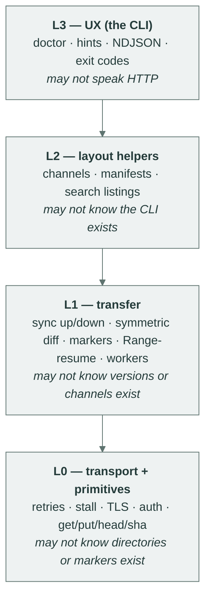
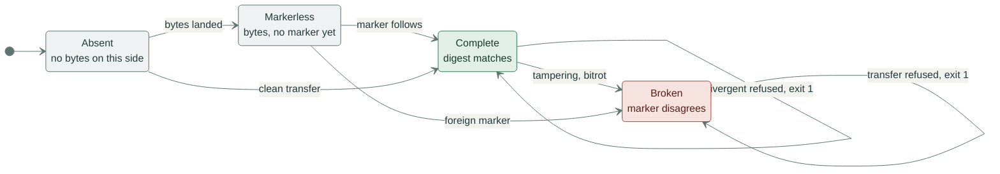
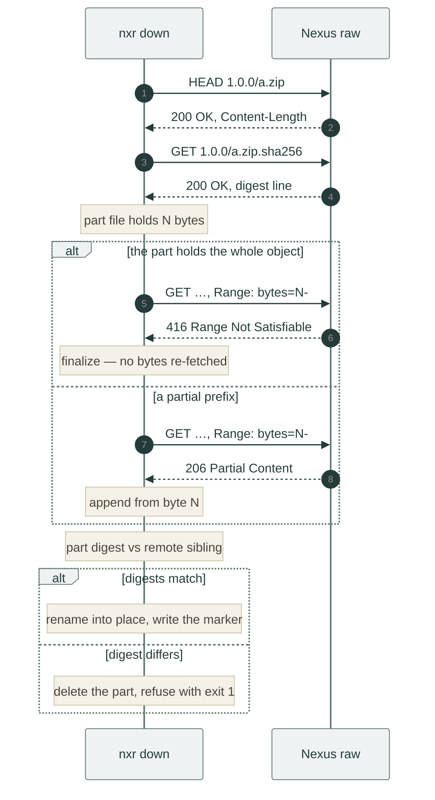

# Design

This page records the decisions behind `nxr` and the alternatives they beat.
The exact wire behavior lives in the [protocol reference](../reference/protocol.md), the commands in the [CLI reference](../reference/cli.md), and the test evidence behind every guarantee in [Conformance](conformance.md).

## The curl model

Scripted artifact flows grow hand-rolled curl snippets: retries, stall detection, digest checks, resume, rewritten in every repository that needs them.
`nxr` replaces those snippets with one binary whose every invocation is self-sufficient: URL in argv, credentials from `-u` or the environment, nothing else.

| Concern | The hand-rolled script | `nxr` |
| :-- | :-- | :-- |
| Retries with backoff | a local loop | built in, transport-level |
| Stalled connections | `--speed-limit` and `--speed-time`, set by hand, forgotten in half the scripts | per-connection stall timeout, on by default |
| Partial artifacts | temp files and `mv`, or the partial survives a crash | hidden part files, rename only after verify |
| Digest check | a second fetch piped to `sha256sum -c` | checked against the remote marker while streaming |
| Markers | written by hand, or forgotten | generated from the bytes, written after them |
| Resume after a break | `curl -C -`, one URL at a time, digest unchecked | Range-resume by default, stable part files per name, digest re-checked |
| What failed | an exit code, if you are lucky | 1 data / 2 misuse / 3 transport, each with a `hint:` line |
| Re-running | re-downloads everything | diffs first, transfers only what is missing |

Config files were rejected for one reason: transferability.
A pipeline must be able to reproduce any call from any machine that has the binary and the environment.
An rc-file quietly breaks that property, because the call now depends on a state the URL does not carry.
The cost is bounded: repeating a long URL is the caller's problem, solved with a shell alias or a CI variable, which is the caller's own tooling rather than a second configuration format.

## Four layers, dependencies point one way

The crate is embeddable at four depths.
Dependencies point one way, from UX down to transport, and no layer ever imports upward.

Each layer is blind on purpose.
L0 knows HTTP, retries, stall detection, TLS and auth, and does not know that directories or markers exist.
L1 knows scans, diffs, markers, workers and Range-resume, and does not know that versions or channels exist.
L2 knows channels, manifests and listings, and does not know the CLI exists.
L3 is the only layer allowed to talk to a human.

The point of the blindness: a wrapper that wants raw PUT-with-retry embeds L0 and nothing above it.
One that wants verified directory sync without opinionated naming embeds L1.
Both enter through the [Rust facade](../reference/api.md).

## Completion is bytes plus a marker

Checksum catalogs, manifests and lockfiles share one flaw: the catalog and the content are two objects with two lifecycles, and every divergence between them is a bug class.
The sha-sibling puts the proof next to the bytes, in `sha256sum -c` format Unix tools already speak.
A name is complete exactly when bytes and sibling both exist and the digest matches.

Markers are mandatory by default because a tool that writes bytes should not leave them uncertified.
A Markerless object is unverifiable, which makes it exactly as useful as a missing object, only harder to notice.
`up` generates missing local siblings before uploading and writes the remote sibling strictly after the bytes.
`--no-sha` makes the opt-out an explicit, greppable decision recorded in the command line instead of a default anyone gets by accident.
The result of that flag is Markerless objects the server never certifies: a deliberate downgrade, and the tests pin that it stays one.

## One diff, two directions, refusals included

The same classification table answers "what is missing here?" for both directions: up asks before sending, down asks before receiving.
Four states per side (Absent, Markerless, Broken, Complete) remove the two hardest bugs of scripted artifact flows: re-uploading what is already there, and consuming a half-written file.
States are per side, and the decision is about the pair.
The full table is in the [protocol reference](../reference/protocol.md).

The gap between `Absent` and `Markerless` is the crash window: the bytes landed, the marker write is still ahead.

The table is conservative in a direction that surprises people once: divergent objects are never overwritten.
A local Complete and a remote Complete with different digests is a mismatch: the transfer refuses and escalates the decision to a human with exit 1.
The client does not pick a winner because it cannot know which side is the truth, and an artifact store is the wrong place to find out.
The same refusal protects a Broken marker on either side, because a foreign object is never shadowed.

Mirror-delete was rejected for the same reason.
A remote-only name found by `up` is a mismatch, not a to-do: acting on it would mean deleting on a server's behalf, and a client that deletes is a different tool.
As far as this client is concerned, the repository stays append-only.

## The core is resume, and resume is asymmetric on purpose

An upload is a pure function of the file content: replaying it after a break converges on the same result.
That is why uploads need no resume protocol (no offsets, no sessions, no server state), and why the cost is bandwidth on re-transfer.
Correctness never depends on the transport remembering anything.

Downloads can and do resume, because HTTP Range is already there.
`down` keeps each name's bytes in a stable part file (`.nxr-part-<hash>`) by default, sends `Range: bytes=N-` when the part holds N bytes, appends on `206`, and restarts from zero on a `200`, the answer of a server that ignored the range.
A resumed part that belongs to an older remote version fails the digest check and is discarded once, and the name restarts from zero under the same check, so a rerun self-heals after a remote update instead of refusing.
`--fresh` starts every name over, and only a fresh download that still diverges refuses with exit 1.
The asymmetry that remains is deliberate: the `get` primitive resumes only under `--continue`, because a primitive trusts the caller to know its part files, while `down` resumes by default, because a rerun of a directory transfer should converge.

`416` means the part already holds the whole object: the previous run died between the last downloaded byte and the rename.
The client finalizes the part, digest-checks it against the remote sibling, and renames or discards.
No bytes are re-fetched for an already-complete part, and that exact absence of a range fetch is pinned by a conformance test.

One upstream quirk is documented honestly.
The Nexus version this client targets answers `500` instead of `416` when a Range request arrives for a zero-byte object, because the range computation in its `PartialFetchHandler` builds a Guava `Range.closed(0, -1)` and crashes.
`nxr` never ranges a zero-length object: a `Range` header goes out only when the part already holds bytes, and a complete part of a zero-byte object is empty, so the request is a plain unconditional GET.
That makes the quirk upstream behavior worth knowing rather than a client contract.

## Enumeration is explicit

A raw repository has no guaranteed directory listing.
The search API varies between server releases, and HEAD-probing for likely names is guessing with extra requests.
So `down` requires an enumeration source (a manifest, explicit names, or an explicitly requested best-effort `--ls`) and refuses with a hint when it has none.

The recommended convention closes the loop.
Each version directory ships a `manifest.json`, which `up` publishes as an ordinary artifact.
The publisher already knows the name list, so encoding it costs one file, and the consumer gets exact enumeration with no server cooperation.
A name list the client cannot know stays a hard refusal, the same philosophy as the exit codes: when the client cannot know, it says so and asks.

## Channels generalize pointers

v0.2 reserved two pointer names.
v0.3 reserves none.
A channel is any token file (`latest`, `stable`, `prod-1`), and the meaning of a name belongs to the publisher rather than the tool.
`channel set` writes the token, and `--if-forward` compares tokens in dotted-numeric version order, which keeps the one property that mattered: a late CI job cannot roll a release back.

What was rejected along the way is claim immutability.
The old reserved pointer tried to be an immutable claim, but a dumb store cannot enforce immutability, so the guarantee was fictional and the special case leaked into every layer.
The special case was deleted and replaced by a comparison the client can perform.

## The transport trusts no single signal

Retries cover connect errors, timeouts, broken bodies and 5xx but never 4xx, where retrying would just re-authenticate a refusal.
A stall timeout replaces a total timeout: a 100 MB artifact over a slow link may legitimately take hours, but no bytes for 30 s is a dead connection.
Auth failures bypass the retry loop entirely, because hammering a 401 is never useful.
Exact numbers live in the [protocol reference](../reference/protocol.md), and the recovery story in [Conformance](conformance.md).

## Exit codes encode the operator's decision

Data problems (exit 1) need a human, invocation problems (exit 2) need a pipeline fix, and transport problems (exit 3) need another attempt later.
Every error carries a `hint:` line so the decision is cheap at 3 a.m.
The full mapping is in [errors and exit codes](../reference/errors.md), and [when it breaks](../how-to/troubleshoot.md) turns it into a procedure.

## What was deliberately left out

Config files and profiles, deletion, repacking, unarchiving, a daemon, a server component.
The repository stays a dumb, verifiable object store.
The client stays a static binary whose dependencies of consequence are reqwest and tokio.
Working within those walls: [publishing a version](../how-to/publish.md), [consuming artifacts](../how-to/consume.md), [CI recipes](../how-to/ci.md).
