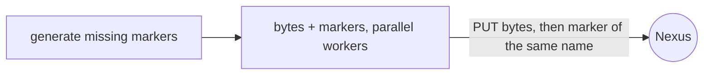

# Get started

A five-minute tour: publish a version directory, then consume it.
Everything runs against a local mock, so no Nexus server is needed yet.

## Prerequisites

- Rust 1.85+ (`rustup`) — the only hard requirement.
- `just` and `uv` — optional, they only wrap the recipes below.

## Install

=== "From the checkout"

    ```bash
    cargo install --path crates/nexus-raw
    nxr --version
    ```

=== "From the source tree (no install)"

    ```bash
    just nxr -- --help
    ```

## Start a throwaway Nexus

The repository ships a mock server with realistic Nexus behavior, including failure scenarios.

```bash
just mock atomic --port 8080
# or, without just:
cargo run -p mock-nexus -- atomic --port 8080
```

```console
listening http://127.0.0.1:8080
```

## Prepare a version directory

Any directory works: every relative path in it becomes an artifact name.

```text
dist/1.4.0/
├── app-1.4.0.zip
├── app-1.4.0.zip.sha256      # optional: up generates missing markers itself
└── pinned.xml
```

Markers are one strict `sha256sum -c` line each — lowercase hex, two spaces, the artifact name.
Ship them by hand if you like:

```console
$ cat app-1.4.0.zip.sha256
9f86d081884c7d65...  app-1.4.0.zip
```

Or don't: `up` hashes the bytes and writes any missing sibling before uploading.

## Publish

```bash
nxr up dist/1.4.0/ http://127.0.0.1:8080/1.4.0/
```

What happens:



```console
$ nxr up dist/1.4.0/ http://127.0.0.1:8080/1.4.0/
plan: 2 to upload, 0 to download, 0 up to date
↑ app-1.4.0.zip ok
↑ pinned.xml ok
uploaded 2, downloaded 0, skipped 0
up: 2 sent, 0 fetched, 0 skipped
```

Run it again — everything is already there, so nothing transfers:

```console
$ nxr up dist/1.4.0/ http://127.0.0.1:8080/1.4.0/
plan: 0 to upload, 0 to download, 2 up to date
up: 0 sent, 0 fetched, 2 skipped
uploaded 0, downloaded 0, skipped 2
```

## Name it

A channel is a token file with any name — `latest` is just the most common one.

```bash
nxr channel set http://127.0.0.1:8080/latest 1.4.0 --if-forward
nxr channel get http://127.0.0.1:8080/latest
```

`--if-forward` compares tokens in dotted-numeric version order, so an older token never replaces a newer one.

## Consume

Give `down` an enumeration source — the usual one is a `manifest.json` in the version directory, which `up` published like any artifact:

```bash
echo '{"artifacts": ["app-1.4.0.zip", "pinned.xml"]}' > dist/1.4.0/manifest.json
nxr up dist/1.4.0/ http://127.0.0.1:8080/1.4.0/     # re-run ships the manifest too
nxr down http://127.0.0.1:8080/1.4.0/ vendor/app/
```

Every artifact is streamed into a part file, hashed while downloading, checked against the marker, then renamed into place — with its own local marker written alongside, so `nxr verify vendor/app/` passes offline.

Without an enumeration source (no server-side `manifest.json`, no `--manifest`, no `--name`, no `--ls`), `down` refuses with a hint instead of guessing.

## Break it on purpose

Kill the transfer mid-flight (`Ctrl-C` on a real server, or use the mock's failure scenarios) and repeat the command — `--continue` picks up each download's part file, and `up` re-runs are always free.

```bash
cargo run -p mock-nexus -- flaky --flaky 3 --port 8080
nxr down http://127.0.0.1:8080/1.4.0/ vendor/app/ --continue
```

## Next steps

- Real servers: URLs and credentials per call — [the CLI reference](reference/cli.md#credentials-and-urls) covers `-u`, `NXR_AUTH` and friends.
- Producers: [publish](how-to/publish.md) covers manifests, channels and the nightly pattern.
- Scripts: [use in CI](how-to/ci.md) documents the NDJSON contract and exit codes.
