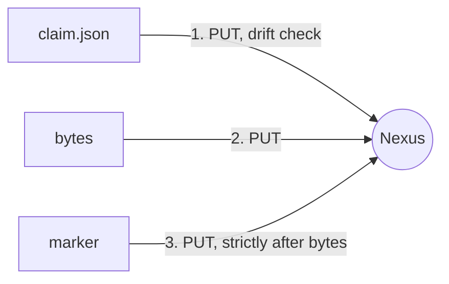

# Get started

A five-minute tour: publish a version directory, then consume it.
Everything runs against a local mock, so no Nexus server is needed yet.

## Prerequisites

- Rust 1.85+ (`rustup`) — the only hard requirement.
- `just` and `uv` — optional, they only wrap the recipes below.

## Install

=== "From the checkout"

    ```bash
    cargo install --path crates/nexus-raw
    nxr --version
    ```

=== "From the source tree (no install)"

    ```bash
    just nxr -- --help
    ```

## Start a throwaway Nexus

The repository ships a mock server with realistic Nexus behavior, including failure scenarios.

```bash
just mock atomic --port 8080
# or, without just:
cargo run -p mock-nexus -- atomic --port 8080
```

```console
listening http://127.0.0.1:8080
```

## Prepare a version directory

A version directory is a `claim.json` plus the artifacts it names, each with a `.sha256` marker.

```text
dist/1.4.0/
├── claim.json
├── app-1.4.0.zip
├── app-1.4.0.zip.sha256
└── pinned.xml
```

<div class="grid" markdown>

<div markdown>
`claim.json` declares the version's artifact list — it is written once, first, and never rewritten.

```json
{
  "claim_version": 1,
  "version": "1.4.0",
  "artifacts": ["app-1.4.0.zip", "pinned.xml"]
}
```
</div>

<div markdown>
Each marker is one strict `sha256sum -c` line: lowercase hex, two spaces, the artifact name.

```console
$ cat app-1.4.0.zip.sha256
9f86d081884c7d65...  app-1.4.0.zip
```
</div>

</div>

!!! tip "Generate markers in one line"

    ```bash
    sha256sum app-1.4.0.zip > app-1.4.0.zip.sha256
    ```

## Publish

```bash
nxr --base http://127.0.0.1:8080/ up --dir dist/1.4.0
```

What happens:



Run it again — everything is already there, so nothing transfers:

```console
$ nxr --base http://127.0.0.1:8080/ up --dir dist/1.4.0
plan: 0 to upload, 0 to download, 2 up to date
uploaded 0, downloaded 0, skipped 2
```

## Point at it

The `latest` pointer is the only mutable state besides version directories.

```bash
nxr --base http://127.0.0.1:8080/ point latest 1.4.0 --if-newer
```

## Consume

```bash
nxr --base http://127.0.0.1:8080/ down --pointer latest --dir vendor/
```

`--pointer latest` resolves to `1.4.0`, the claim is fetched, and only missing artifacts are downloaded.
Every artifact is hashed while streaming and checked against the remote marker before it lands under its final name.

## Break it on purpose

Kill the transfer mid-flight (`Ctrl-C` on a real server, or use the mock's failure scenarios) and repeat the command — the diff picks up exactly the missing tail.

```bash
cargo run -p mock-nexus -- flaky --flaky 3 --port 8080
nxr --base http://127.0.0.1:8080/ down --pointer latest --dir vendor/
```

## Next steps

- Real servers: [configure profiles](how-to/configure.md) once, then drop `--base` everywhere.
- Producers: [publish](how-to/publish.md) covers dry runs, `--names` and pointer strategy.
- Scripts: [use in CI](how-to/ci.md) documents the NDJSON contract and exit codes.
