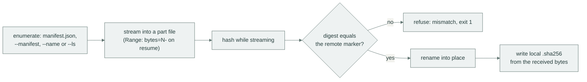

# Consume artifacts

The consumer side, end to end: resolve which version is current, fetch it (or a slice of it) into a directory you can build against, and prove it intact without the network.

The scenario behind every transcript here: your build needs the artifacts of version `1.4.0` from the `raw-main` repository into `vendor/app/`.

## Prerequisites

- Reachable repository URL, for example `https://nexus.example.com/repository/raw-main/`.
- Credentials that may read it (`export NXR_USERNAME=… NXR_PASSWORD=…`).
- A target directory, created on demand.

## Choosing an enumeration source

`down` must know *which names* to fetch, and a Nexus raw repository has no guaranteed directory listing.
Every `down` names its source, explicitly or through one convention:

| Source | Invocation | Reach for it when |
|:-------|:-----------|:------------------|
| `manifest.json` at the version URL | `nxr down <ver-url>/ vendor/app/` | the publisher shipped one, the usual case |
| a manifest file, URL or stdin | `nxr down <ver-url>/ vendor/app/ --manifest m.json` | you maintain your own name list or a subset of one |
| explicit names, repeatable | `nxr down <ver-url>/ vendor/app/ --name app.zip` | a job needs one or two files from a large version |
| server search API | `nxr down <ver-url>/ vendor/app/ --ls` | nothing else is available: best effort, experimental, needs a server with the search API and a repository-style URL |

With no source and no server-side `manifest.json`, `down` refuses instead of guessing:

```console
$ nxr down https://nexus.example.com/repository/raw-main/1.3.0/ vendor/old/
error: cannot enumerate: https://nexus.example.com/repository/raw-main/1.3.0/: no manifest.json on the server and no --manifest/--name/--ls given
hint: pass --manifest <file|url|->, repeat --name, or use --ls when the server has the search API
```

Every name a source lists must exist, locally or remotely. A typo stops the run with `missing` instead of silently fetching less.

## Resolve the version through a channel

Publishers tag the current version with a channel token.
Resolve it, then download the directory it names:

```bash
V=$(nxr channel get https://nexus.example.com/repository/raw-main/latest)   # (1)!
nxr down "https://nexus.example.com/repository/raw-main/$V/" vendor/app/    # (2)!
```

1. Prints the bare token, so `$(…)` captures exactly the version.
2. The trailing slash matters: everything under this URL is the version.

```console
$ nxr down https://nexus.example.com/repository/raw-main/1.4.0/ vendor/app/
plan: 0 to upload, 3 to download, 0 up to date
↓ bom/linux-x86_64.json ok
↓ pinned.xml ok
↓ app-1.4.0.zip ok
uploaded 0, downloaded 3, skipped 0
down: 0 sent, 3 fetched, 0 skipped
```

Three names listed in `manifest.json`, three fetched.
`manifest.json` itself is the map, not the territory: it is not copied into the target directory.

### What the pipeline guarantees

For every name, the same five steps run, in parallel across `--workers`:



Two consequences worth internalizing:

- A name that dies mid-download leaves only a hidden part file (`.nxr-part-<hash>`): the destination never holds partial bytes under a real name.
- The local marker is computed from the received bytes, so the result verifies offline even if the server had no marker.

## Re-runs diff instead of re-downloading

Delete a file (or lose it to a crashed build) and run the same command again:

```console
$ nxr down https://nexus.example.com/repository/raw-main/1.4.0/ vendor/app/
plan: 0 to upload, 1 to download, 2 up to date
○ app-1.4.0.zip skipped
○ bom/linux-x86_64.json skipped
↓ pinned.xml ok
uploaded 0, downloaded 1, skipped 2
down: 0 sent, 1 fetched, 2 skipped
```

Only the missing name transfers. Names whose digest matches the server are skipped.
A locally complete artifact whose digest *diverges* refuses the run instead of being overwritten (see [when it breaks](troubleshoot.md#divergent-objects-are-never-overwritten)).

An interrupted pull recovers the same way: repeat the command with `--continue` and the part files resume through `Range` requests.
The full walkthrough with a real interruption: [break it on purpose](../get-started.md#break-it-on-purpose).

## Fetch a subset

Large version, small job. Name what you need and repeat `--name` as often as needed:

```console
$ nxr down https://nexus.example.com/repository/raw-main/1.4.0/ vendor/subset/ --name app-1.4.0.zip
plan: 0 to upload, 1 to download, 0 up to date
↓ app-1.4.0.zip ok
uploaded 0, downloaded 1, skipped 0
down: 0 sent, 1 fetched, 0 skipped
```

For longer lists, keep a manifest file in your own repository and point `--manifest` at it (a file, a URL, or `-` for stdin).
The publisher-side rules apply unchanged: every listed name must exist, ghosts refuse the run.

## Verify without the network

Before building against the result, or after any manual fiddling, check every artifact against its marker, entirely offline:

```console
$ nxr verify vendor/app/
verify: 3 ok, FAILED: none
```

A tampered file is named and refuses with exit 1:

```console
$ nxr verify vendor/app/
uploaded 0, downloaded 0, skipped 2
error: incomplete: bom/linux-x86_64.json
hint: rerun the same command; finished names are skipped and the rest is retried
failed: bom/linux-x86_64.json
```

`verify` checks a directory you own, so you have two honest repairs: delete the offending file and let the next `down` refill it, or rebuild the artifact and regenerate its marker with `sha256sum`, whichever matches why the digest drifted.
Pass `--manifest` to check a subset instead of the whole directory.

As the last gate of a consumer CI job, `verify` costs no network and catches every silent corruption upstream (see [a consumer job](ci.md#a-consumer-job)).

## Next steps

- Publish the versions you consume: [publish a version](publish.md).
- The failure catalogue behind every refusal above: [when it breaks](troubleshoot.md).
- Flags, credentials and URL rules in full: [CLI reference](../reference/cli.md).
- What the part files and markers look like on the wire: [the wire protocol](../reference/protocol.md).
