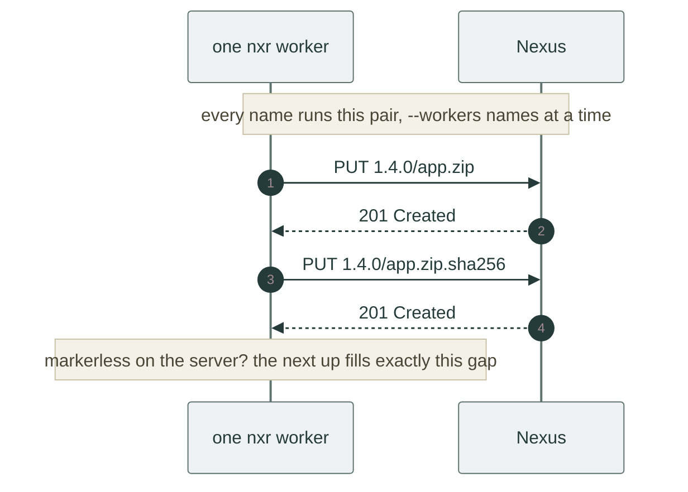

# Publish a version

The producer side, end to end: take a build directory from *nothing on the server* to *published, named and re-runnable*, on a real Sonatype Nexus with authentication on.

The scenario behind every transcript here: a release directory `1.4.0/` with an application archive, a bill of materials and a pin file, going to the `raw-main` repository.

## Prerequisites

- Reachable repository URL, for example `https://nexus.example.com/repository/raw-main/`.
- Credentials that may write to it.
- A build output directory on disk.

Put the credentials in the environment once and every later command picks them up:

```bash
export NXR_USERNAME=deployer
export NXR_PASSWORD="…"        # (1)!
```

1. Prefer your CI's masked variable here.
   `nxr` also accepts `NXR_AUTH` (base64 `user:pass`) or `-u user:pass` per call.

## The shape of a version directory

```text
dist/1.4.0/
├── app-1.4.0.zip              # bytes
├── bom/
│   └── linux-x86_64.json      # subdirectories are names too
├── manifest.json              # optional: the enumeration source for consumers
└── pinned.xml
```

Every relative path under the directory is an artifact name.
Segments match `[A-Za-z0-9._-]+`, and only the `.sha256` suffix is reserved: `latest`, `nightly` and `version.json` are ordinary names if your convention uses them.
Before anything touches the network, every local file is classified against its sibling marker (see [the object states](troubleshoot.md#the-four-states-of-an-object)).

## Look before you leap: the dry run

`--dry-run` prints the plan and transfers nothing:

```console
$ nxr up --dry-run dist/1.4.0/ https://nexus.example.com/repository/raw-main/1.4.0/
upload app-1.4.0.zip
upload bom/linux-x86_64.json
upload manifest.json
upload pinned.xml
```

The plan lists artifact names, not marker uploads, because each name carries its marker along automatically.

## Publish

```bash
nxr up dist/1.4.0/ https://nexus.example.com/repository/raw-main/1.4.0/   # (1)!
```

1. Re-running this exact line is always safe: finished names are skipped, missing ones transfer, diverging ones refuse.

```console
$ nxr up dist/1.4.0/ https://nexus.example.com/repository/raw-main/1.4.0/
plan: 4 to upload, 0 to download, 0 up to date
↑ bom/linux-x86_64.json ok
↑ manifest.json ok
↑ app-1.4.0.zip ok
↑ pinned.xml ok
up: 4 sent, 0 fetched, 0 skipped
uploaded 4, downloaded 0, skipped 0
```

Each name goes up as a pair: the bytes first, then its `sha256sum -c` marker.
With the default `--workers 8`, several names travel at once, but within a name the marker is never sent before its bytes:



A crash between the two PUTs leaves the object with bytes but no marker, obviously unfinished. The next `up` repairs exactly that.
[When it breaks](troubleshoot.md#interrupted-transfers) shows the repair.

Re-run the same command and the second transfer is free:

```console
$ nxr up dist/1.4.0/ https://nexus.example.com/repository/raw-main/1.4.0/
up: 0 sent, 0 fetched, 4 skipped
plan: 0 to upload, 0 to download, 4 up to date
○ app-1.4.0.zip skipped
○ bom/linux-x86_64.json skipped
○ manifest.json skipped
○ pinned.xml skipped
uploaded 0, downloaded 0, skipped 4
```

### Markers: `--sha` against `--no-sha`

| | default (`up`, `put --sha`) | `up --no-sha` |
|:--|:--|:--|
| What is uploaded | bytes + a `<name>.sha256` marker per name | bytes only |
| Marker source | an existing sibling is checked, a missing one is generated from the bytes | none, none generated |
| Consumer side | `down` can check digests, `verify` works offline | nothing to check against |
| Divergence detection | refuses on any disagreement | blind spots everywhere |
| Use it for | anything a human or a pipeline will consume | scratch data nobody verifies |

A hand-written marker is welcome: if the sibling exists locally, `up` checks it against the bytes and refuses on disagreement instead of quietly "fixing" it.
On the server, the marker is an ordinary object, 80 bytes of `digest  name` served as `text/plain`:

```console
$ nxr head https://nexus.example.com/repository/raw-main/1.4.0/app-1.4.0.zip.sha256
head: 200 80 text/plain
```

!!! warning "`--no-sha` leaves objects uncertified"

    Bytes uploaded with `--no-sha` have no marker on the server.
    A later `up` of a marker-bearing directory classifies them as `Markerless` and fills the gap, but until then nothing can detect corruption or divergence for those names.

## When `up` refuses

Two situations stop the run before a single byte moves, because continuing would overwrite something:

A local file disagrees with its own marker because the bytes drifted after the marker was written:

```console
$ nxr up dist/1.4.0/ https://nexus.example.com/repository/raw-main/1.4.0/
error: mismatch: pinned.xml: local object is broken and must not be overwritten: digest mismatch: sibling 8aca37a7…, actual 4116253a…
hint: the two sides diverge; delete or fix one copy, never let nxr overwrite a diverging object
```

A local copy is complete and valid, but the server already holds a *different* complete object under the same name, for example a rebuild with different flags published twice into one version:

```console
$ nxr up dist/1.4.0/ https://nexus.example.com/repository/raw-main/1.4.0/
error: mismatch: app-1.4.0.zip: complete on both sides with different digests: local fec438ab…, remote 58e575b6…
hint: the two sides diverge; delete or fix one copy, never let nxr overwrite a diverging object
```

Both refuse with exit 1.
Fix the cause (rebuild, or republish under a new version directory) and run again.
`nxr` never deletes and never overwrites a diverging object.

## Restrict the transfer with a manifest

`--manifest` takes a file, a URL, or `-` for stdin and limits the run to the listed names:

```bash
echo '{"artifacts": ["app-1.4.0.zip", "pinned.xml"]}' \
  | nxr up dist/1.4.0/ https://nexus.example.com/repository/raw-main/1.4.0/ --manifest -   # (1)!
```

1. Everything listed must exist locally, and one ghost name refuses the whole run:

    ```console
    $ echo '{"artifacts": ["app-1.4.0.zip", "ghost.zip"]}' | nxr up … --manifest -
    error: missing: ghost.zip: exist nowhere
    hint: the name is absent on both sides; check spelling and the manifest
    ```

Exit 1, nothing uploaded.
The same strictness makes `--manifest` a safety belt for scripted subsets: a typo stops the pipeline instead of silently publishing less.

## Ship a manifest for consumers

A `manifest.json` in the version directory is what lets consumers run `down` without extra flags:

```json
{"artifacts": ["app-1.4.0.zip", "bom/linux-x86_64.json", "pinned.xml"]}
```

Keep the file in the version directory before uploading. `up` ships it like any artifact, marker included.
`down` reads it as the enumeration source and fetches the listed names.
It does not pull `manifest.json` itself into the target directory.

Without it, consumers must pass `--manifest`, `--name` or `--ls` (see the decision table in [consume artifacts](consume.md#choosing-an-enumeration-source)).

## Name the version with a channel

A channel is a token file at any URL.
Write it after a successful publish and any consumer can resolve *the version to use* without hard-coding one:

```bash
nxr channel set https://nexus.example.com/repository/raw-main/latest 1.4.0 --if-forward   # (1)!
```

1. `--if-forward` writes only when the new token compares forward in dotted-numeric version order.

```console
$ nxr channel set …/raw-main/latest 1.4.0 --if-forward
channel: set …/raw-main/latest → 1.4.0
$ nxr channel set …/raw-main/latest 1.0.0 --if-forward
channel: kept …/raw-main/latest at 1.4.0 (forward-only)
$ nxr channel get …/raw-main/latest
1.4.0
```

The `kept` line is the rollback guard: a late CI job running an older branch cannot roll `latest` back.
Drop `--if-forward` only when you really mean to force the token. The `nightly` channel is the usual place where that is true.

## A nightly pattern

```bash
V="nightly-$(date +%F)"
BASE=https://nexus.example.com/repository/raw-main
mkdir -p "dist/$V" && install out/* "dist/$V/"
( cd "dist/$V" && printf '{"artifacts": [%s]}\n' \
    "$(ls | sed 's/.*/"&"/' | paste -sd, -)" > manifest.json )
nxr up "dist/$V/" "$BASE/$V/"                 # (1)!
nxr channel set "$BASE/nightly" "$V"          # (2)!
```

1. No marker step: `up` generates and uploads the `.sha256` siblings itself.
2. No `--if-forward`: each nightly is a fresh directory, so the token always moves forward anyway.

Every nightly is its own directory. Version directories are never reused, which is exactly why re-runs, resume and forward-only channels stay cheap.

!!! note "Deleting is out of scope"

    `nxr` never deletes: version cleanup stays a manual, server-side operation.

## Next steps

- The consumer mirror of this page: [consume artifacts](consume.md).
- Wire it into a pipeline: [use in CI](ci.md).
- What a marker looks like on the wire: [the wire protocol](../reference/protocol.md).
- When `up` refuses and what the words mean: [when it breaks](troubleshoot.md).
