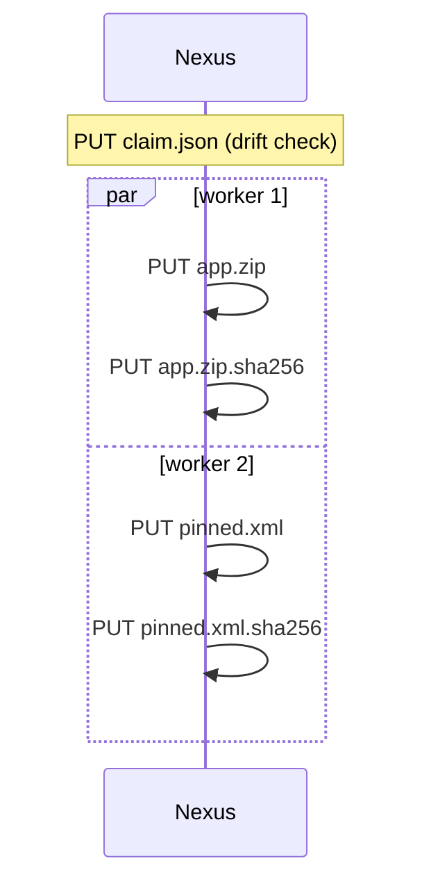

# Publish a version

The producer side: take a build directory from *nothing on the server* to *published, pointed at and re-runnable*.

## The shape of a version directory

```text
dist/1.4.0/
├── claim.json                 # the version's contract
├── app-1.4.0.zip              # bytes
├── app-1.4.0.zip.sha256       # its marker
├── bom/
│   └── linux-x86_64.json      # subdirectories are names too
│   └── linux-x86_64.json.sha256
└── pinned.xml
```

Rules the client enforces before anything leaves the machine:

- every claim name must be **complete** locally: bytes present, marker present, digest matching.
- names may not collide with protocol objects: no `claim.json`, no `latest`/`nightly`, no `.sha256` suffix.
- segments match `[A-Za-z0-9._-]+` and are at most 255 bytes.

A violation is a local build problem and fails with exit code 1 or 2 before any request is made.

## Preview, then publish

```bash
nxr diff --profile main --dir dist/1.4.0        # the plan, nothing written
nxr up   --profile main --dir dist/1.4.0 --dry-run
nxr up   --profile main --dir dist/1.4.0        # the real thing
```

The write order is fixed:



The claim is checked first: if the server already holds a **different** claim under that version, the run refuses with `claim drift` — claims are immutable, republish under a new version instead.

## Resume is the same command

An interrupted `up` leaves the server with whatever completed — possibly some bytes without markers.
Run it again:

- the diff classifies every claim name against the server,
- complete-and-equal names are skipped,
- the rest transfer again.

There is no `--resume` flag because there is nothing else to do.

## Pointers

Pointers are one-line files at the repository root (`latest`, `nightly`) naming a version.

```bash
nxr point latest 1.4.0 --if-newer --profile main
nxr point nightly nightly-2026.09.25 --profile main
```

`--if-newer` moves a pointer only forward in version order, so a late CI job can never roll a release back.

```console
$ nxr point latest 1.0.0 --if-newer --profile main
skip: latest already at 1.5.0
```

## A nightly pattern

```bash
V="nightly-$(date +%F)"
mkdir -p dist/"$V" && install out/* dist/"$V"/
( cd dist/"$V"
  for f in *; do
    case $f in *.sha256|claim.json) continue ;; esac
    sha256sum "$f" > "$f.sha256"
  done )
nxr up --profile nightly --dir dist/"$V"
nxr point nightly "$V" --profile main
```

!!! tip "Markers are just `sha256sum` lines"

    `<hex>  <name>\n` — two spaces, lowercase hex, trailing newline — exactly what `sha256sum f > f.sha256` writes.
    `nxr verify` is the judge of any marker you produce.

Every nightly is a fresh immutable version.
`nightly` just names the newest one.

!!! note "Deleting is out of scope"

    `nxr` never deletes: version cleanup stays a manual server-side operation.
    Immutability is what makes resume and pointer safety cheap.
