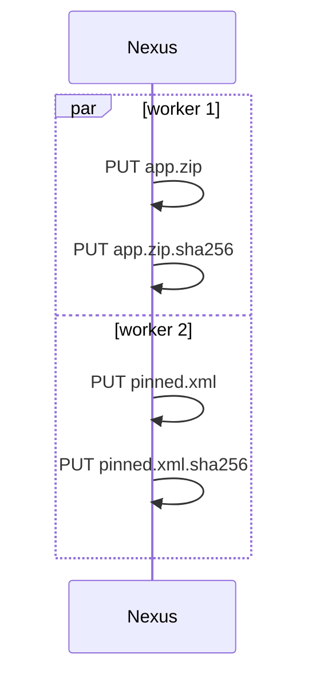

# Publish a version

The producer side: take a build directory from *nothing on the server* to *published, named and re-runnable*.

## The shape of a version directory

```text
dist/1.4.0/
├── app-1.4.0.zip              # bytes
├── app-1.4.0.zip.sha256       # its marker
├── bom/
│   └── linux-x86_64.json      # subdirectories are names too
│   └── linux-x86_64.json.sha256
├── manifest.json              # optional: the enumeration source for consumers
└── pinned.xml
```

Every relative path under the directory is an artifact name.
Segments match `[A-Za-z0-9._-]+` and only the `.sha256` suffix is reserved — `claim.json`, `latest`, `nightly` are ordinary names if your convention uses them.
A name whose local marker disagrees with its bytes refuses the run before any request is made.

## Markers are automatic

`up` writes markers by default:

- existing local `<name>.sha256` siblings are checked against the bytes, then uploaded.
- missing siblings are generated from the bytes, so hand-made markers are welcome but not required.
- the generated marker is the same `sha256sum -c` line you would write yourself.

```bash
# equivalent, pick either style:
sha256sum app-1.4.0.zip > app-1.4.0.zip.sha256
nxr put https://nexus.example.com/repository/raw-main/1.4.0/app-1.4.0.zip -f app-1.4.0.zip --sha
```

`--no-sha` opts out on purpose: bytes are uploaded, markers are neither generated nor sent, and the server objects stay uncertified.
Use it only for data nobody will verify.

## Publish

```bash
nxr up --dry-run dist/1.4.0/ https://nexus.example.com/repository/raw-main/1.4.0/   # the plan
nxr up dist/1.4.0/ https://nexus.example.com/repository/raw-main/1.4.0/            # the real thing
```

The write order is fixed: bytes first, then the marker of the same name.



A crash between bytes and marker leaves the object `Markerless` — obviously unfinished, and the next `up` fills exactly that gap.
Nothing else about a re-run is special: identical names are skipped, missing ones transfer, divergent ones refuse.

## Restrict the transfer

```bash
nxr up dist/1.4.0/ https://nexus.example.com/repository/raw-main/1.4.0/ --manifest selected.json
```

`--manifest` (a file, a URL or `-` for stdin) limits the transfer to the names in `{"artifacts": [...]}`.
Every listed name must exist locally, or the run refuses with `missing`.

## Ship a manifest for consumers

A `manifest.json` in the published directory is what makes `down` work without flags:

```json
{"artifacts": ["app-1.4.0.zip", "bom/linux-x86_64.json", "pinned.xml"]}
```

Keep it in the version directory before uploading — `up` treats it like any artifact.
Without it, consumers must pass `--manifest`, `--name` or `--ls` explicitly.

## Name it with a channel

A channel is a token file at any name:

```bash
nxr channel set https://nexus.example.com/repository/raw-main/latest 1.4.0 --if-forward
nxr channel set https://nexus.example.com/repository/raw-main/nightly 1.4.0
```

`--if-forward` writes only when the new token compares forward in dotted-numeric version order, so a late CI job can never roll a release back.

```console
$ nxr channel set .../latest 1.0.0 --if-forward
channel: kept …/latest at 1.5.0 (forward-only)
```

## A nightly pattern

```bash
V="nightly-$(date +%F)"
mkdir -p "dist/$V" && install out/* "dist/$V/"
( cd "dist/$V" && printf '{"artifacts": [%s]}\n' \
    "$(ls | sed 's/.*/"&"/' | paste -sd, -)" > manifest.json )
nxr up "dist/$V/" "https://nexus.example.com/repository/raw-main/$V/"
nxr channel set https://nexus.example.com/repository/raw-main/nightly "$V" --if-forward
```

Markers need no step: `up` generates them from the bytes.
Every nightly is a fresh directory, and the channel just names the newest one.

!!! note "Deleting is out of scope"

    `nxr` never deletes: version cleanup stays a manual server-side operation.
    Immutability is what makes resume and forward-only channels cheap.
