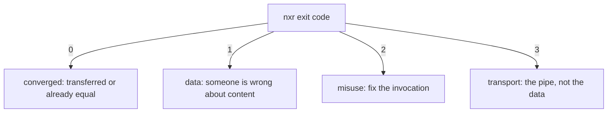

# When it breaks

Every failure has a name, an exit code and a cause.
Find yours, fix the cause, repeat the command.

## Decoding a failure

```console
$ nxr up --profile main --dir dist/1.4.0
error: mismatch: app-1.4.0.zip: complete on both sides with different digests: local 9f86…, remote 2c26…
```

The first word is the error kind; the message names the artifact and both sides of the disagreement.

| Message | Exit | What it means | Fix |
|:--------|:-----|:--------------|:----|
| `mismatch: <name>: complete on both sides with different digests` | 1 | the same version holds two different artifacts | nobody overwrites: republish under a new version, or remove the server copy manually |
| `incomplete: <names>` | 1 | a local build is not Complete: bytes without a marker, or a broken marker | rebuild; `nxr verify --dir …` lists the offenders |
| `claim drift: version <v>` | 1 | the remote claim differs from the local one | claims are immutable: publish under a new version |
| `missing: <names>` | 1 | a claimed artifact exists nowhere | the version is broken on the server; fix or remove it manually |
| `unsafe name: <name>` | 2 | a name collides with protocol objects or the grammar | rename the artifact |
| `misuse: …` | 2 | bad flags, missing directory, config problem | fix the invocation |
| `auth: <url>` | 3 | 401/403, or credentials missing where required | check `NXR_AUTH` / `NXR_<PROFILE>_AUTH` |
| `transport: <url>: …` | 3 | network, TLS, timeouts — retries exhausted | repeat the command later; resume is free |
| `http <status>: <url>` | 3 | an unexpected response | inspect the URL; usually a wrong base or a proxy |

## Exit codes at a glance



## Interrupted transfers

A transfer killed mid-flight leaves at most temp files (`.nxr-tmp-…`) in the destination directory.
They are swept automatically on the next run, and a partially fetched name never reaches its final path.

```bash
nxr down --profile main --pointer latest --dir vendor/app   # just repeat it
```

## Half-published versions

A version whose `up` died early has some artifacts and maybe no markers.
Nothing is corrupt — the server objects are individually complete or absent, and the next `up` fills the gap.
Only a `claim.json` that differs from what you publish now is refused: that is [claim drift](../reference/protocol.md#the-write-order).

## TLS problems

Certificate verification is on by default.
For a test server with a self-signed certificate, allow it per profile instead of weakening the default:

```toml
[dev]
url = "http://localhost:8080/repository/raw-dev/"
tls_insecure = true
```

## Debugging aids

- `-v` — transfer starts, retry attempts with reasons.
- `--json` — every event as a line; pipe to `jq`.
- The mock server replays failure modes deterministically:

```bash
just mock partial-put --port 8080      # cuts the first PUT body
just mock slow --chunk-delay-ms 2000   # a trickle for stall testing
```

See [conformance](../explanation/conformance.md) for the full scenario table.
