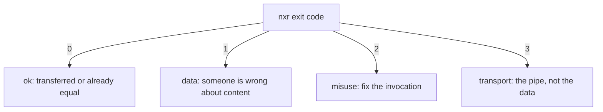

# When it breaks

Every failure has a name, an exit code and a hint.
Find yours, fix the cause, repeat the command.

## Decoding a failure

```console
$ nxr up dist/1.4.0/ https://nexus.example.com/repository/raw-main/1.4.0/
error: mismatch: app-1.4.0.zip: complete on both sides with different digests: local 9f86…, remote 2c26…
hint: the two sides diverge; delete or fix one copy, never let nxr overwrite a diverging object
```

The first word is the error kind.
The message names the artifact and both sides of the disagreement.
The `hint:` line names the next check.

| Message | Exit | What it means | Fix |
|:--------|:-----|:--------------|:----|
| `mismatch: <name>: complete on both sides with different digests` | 1 | the same name holds two different artifacts | nobody overwrites: republish under a new name, or remove one copy manually |
| `mismatch: <name>: local object is broken` | 1 | local bytes disagree with the local marker | rebuild the file and regenerate its marker |
| `mismatch: <name>: unverifiable on both sides` | 1 | bytes without a marker on both sides | fetch a good copy, or delete one side and re-transfer |
| `incomplete: <names>` | 1 | local copies are not Complete at `verify` | rebuild — the list names the offenders |
| `missing: <names>` | 1 | a requested name exists nowhere | check spelling, the manifest and the version directory |
| `cannot enumerate: <url>` | 1 | `down` has no name list | ship a `manifest.json`, or pass `--manifest` / `--name` / `--ls` |
| `unsafe name: <name>` | 2 | a name fails the grammar or uses the reserved `.sha256` suffix | rename the artifact |
| `misuse: …` | 2 | bad flags, missing directory, half-set credentials | fix the invocation |
| `auth: <url>` | 3 | 401/403, or credentials missing where required | check `NXR_AUTH` / `NXR_USERNAME` + `NXR_PASSWORD`, or pass `-u` |
| `transport: <url>: …` | 3 | network, TLS, stall, timeouts — retries exhausted | repeat the command later — resume is free |
| `http <status>: <url>` | 3 | an unexpected response | inspect the URL, usually a wrong path or a proxy |

The full taxonomy: [errors and exit codes](../reference/errors.md).

## Exit codes at a glance



## Interrupted transfers

A killed `down` leaves part files (`.nxr-part-<hash>`) in the destination directory.
They are never garbage: `--continue` resumes from them through `Range: bytes=N-`.
Without `--continue` the transfer starts over and the parts are rewritten.
A partially fetched name never reaches its final path — bytes rename in only after the digest checked out.

```bash
nxr down https://nexus.example.com/repository/raw-main/1.4.0/ vendor/app/ --continue
```

A killed `up` leaves the server with whatever completed — possibly some bytes without markers.
Repeat the same command: the diff classifies every name, complete ones are skipped, `Markerless` and absent ones transfer again.
No flags change, no resume mode to remember.

## `down` refuses with "cannot enumerate"

Nexus raw has no guaranteed listing, and `down` refuses to guess.
Three ways out, in order of preference:

1. publish a `manifest.json` into the version directory (see [publish](publish.md)) — then plain `nxr down <ver-url>/ dst/` works.
2. pass the names explicitly: `--manifest <file|url|->` or repeatable `--name`.
3. `--ls` for a best-effort walk through the server search API, which depends on the server release.

## Half-published versions

A version whose `up` died early has some artifacts and maybe missing markers.
Nothing is corrupt — each server object is individually complete or absent, and the next `up` fills the gap, generating the missing markers from the local bytes if the local directory lacks them too.

## TLS problems

Certificate verification is on by default.
For a test server with a self-signed certificate, switch it off per call instead of weakening any global state:

```bash
nxr --tls-insecure ls http://localhost:8080/repository/raw-dev/
```

`nxr doctor` reports the switch loudly — verification OFF is a deliberate choice, fine for a local mock, dangerous beyond it.

## Debugging aids

- `nxr doctor [URL]` — credentials, TLS, settings, reachability, without printing secrets.
- `-v` — transfer starts, plan names, retry attempts with reasons.
- `--json` — every event as NDJSON, ready to pipe to `jq`.
- The mock server replays failure modes deterministically:

```bash
just mock partial-put --port 8080      # cuts the first PUT body
just mock slow --chunk-delay-ms 2000   # a trickle for stall testing
```

See [conformance](../explanation/conformance.md) for the full scenario table.
