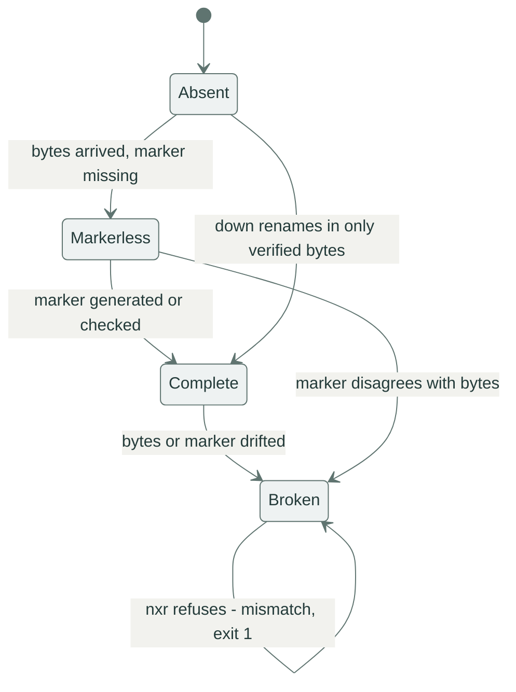

# When it breaks

Every failure has a name, an exit code and a hint.
Find yours in the tables, fix the cause, repeat the command — resume and re-runs are free by design.

## Anatomy of a failure

```console
$ nxr up dist/1.4.0/ https://nexus.example.com/repository/raw-main/1.4.0/
error: mismatch: app-1.4.0.zip: complete on both sides with different digests: local fec438ab…, remote 58e575b6…
hint: the two sides diverge; delete or fix one copy, never let nxr overwrite a diverging object
```

Three lines, three jobs.
The `error:` line starts with the error *kind* and names the artifact and both sides of the disagreement.
The `hint:` line names the next check — the same text travels in the `hint` field of `--json` output.
The process exit code separates data problems from transport trouble.

## Exit codes: cause and fix

| Exit | Kind | Cause | Fix |
|:-----|:-----|:------|:----|
| `0` | ok | transferred, converged or verified | carry on |
| `1` | `mismatch` | two sides disagree about a name's content | nobody overwrites: rebuild, or republish under a new version directory |
| `1` | `incomplete` | local copies unfinished at `verify` | rebuild — the list names the offenders |
| `1` | `missing` | a requested name exists nowhere | check spelling, the manifest and the version directory |
| `1` | `cannot enumerate` | `down` has no name list | ship `manifest.json`, or pass `--manifest` / `--name` / `--ls` |
| `2` | `unsafe name` | a name fails the grammar | rename the artifact |
| `2` | `misuse` | bad flags, missing directory, half-set credentials | fix the invocation |
| `3` | `auth` | 401/403 or missing credentials | check `NXR_AUTH` / `NXR_USERNAME` + `NXR_PASSWORD`, or pass `-u` |
| `3` | `transport` | network, TLS, stall — retries exhausted | repeat the command later, resume is free |
| `3` | `http <status>` | an unexpected response | read the status: 404 is a wrong path, 429 is a rate limit |

Full taxonomy with every field: [errors and exit codes](../reference/errors.md).

## The four states of an object

Every name — local or on the server — is in exactly one of four states.
`up` and `down` diff the two sides state by state, and the refusals fall out of the diff:



`Complete` means bytes plus a sibling whose digest matches.
`Markerless` means bytes only — normal mid-transfer, suspicious when a run finished.
`Broken` means bytes and marker disagree, and `nxr` will not "fix" it by overwriting: the next `up` or `down` refuses with `mismatch` until a human deletes or repairs one side.
`Absent` means no bytes, and a marker without bytes reads as `Absent`.

## Divergent objects are never overwritten

The refusal you will meet most often, with its two faces:

A local file drifted after its marker was written:

```console
$ nxr up dist/1.4.0/ https://nexus.example.com/repository/raw-main/1.4.0/
error: mismatch: pinned.xml: local object is broken and must not be overwritten: digest mismatch: sibling 8aca37a7…, actual 4116253a…
hint: the two sides diverge; delete or fix one copy, never let nxr overwrite a diverging object
```

The same name holds two different artifacts on the two sides — for example a rebuild published into a version directory that was already used:

```console
$ nxr up dist/1.4.0/ https://nexus.example.com/repository/raw-main/1.4.0/
error: mismatch: app-1.4.0.zip: complete on both sides with different digests: local fec438ab…, remote 58e575b6…
hint: the two sides diverge; delete or fix one copy, never let nxr overwrite a diverging object
```

Exit 1 in both cases, and nothing was sent.
The way out is a decision, not a flag: rebuild and fix the local copy, or publish the new content under a new version directory and move the channel.
Version directories are cheap precisely so you never have to argue with an existing one.

## Interrupted transfers

Kill a `get` mid-flight and the bytes so far live in a part file next to the target:
`timeout` here stands in for `Ctrl-C`:

```console
$ timeout 4 nxr get https://nexus.example.com/repository/raw-main/1.4.0/app-1.4.0.zip -o app.zip
killed, timeout exit=124
```

Nothing partial ever hides under the real name — everything fetched so far sits in `app.zip.part`.
Repeat the command with `--continue` and the transfer resumes through a `Range: bytes=N-` request instead of starting over:

```console
$ nxr get https://nexus.example.com/repository/raw-main/1.4.0/app-1.4.0.zip -o app.zip --continue
get: 3000000 bytes → app.zip (resumed from 917504)
```

The `(resumed from …)` figure is the part-file size the server was asked to continue from.
For a whole directory the same story runs through `down --continue` — see [the tour](../get-started.md#break-it-on-purpose) for the part-file anatomy.

A killed `up` leaves the server with whatever completed: some names `Complete`, the name in flight `Markerless` or `Absent`.
No repair mode exists because none is needed — repeat the same command and the diff re-sends exactly the unfinished names:

```console
$ curl -T app-1.4.0.zip https://nexus.example.com/repository/raw-main/half/1.0.0/app-1.4.0.zip   # (1)!
$ nxr up dist/1.4.0/ https://nexus.example.com/repository/raw-main/half/1.0.0/
plan: 4 to upload, 0 to download, 0 up to date
↑ manifest.json ok
↑ bom/linux-x86_64.json ok
↑ pinned.xml ok
↑ app-1.4.0.zip ok
uploaded 4, downloaded 0, skipped 0
up: 4 sent, 0 fetched, 0 skipped
```

1. Someone crashed here earlier: the archive is on the server, its marker is not.

The pre-existing bytes are not skipped as "good enough" — a `Markerless` remote name is re-sent complete with its marker, because an unverifiable object is not done.

## `down` refuses with "cannot enumerate"

Nexus raw has no guaranteed listing, and `down` refuses to guess:

```console
$ nxr down https://nexus.example.com/repository/raw-main/1.3.0/ vendor/old/
error: cannot enumerate: https://nexus.example.com/repository/raw-main/1.3.0/: no manifest.json on the server and no --manifest/--name/--ls given
hint: pass --manifest <file|url|->, repeat --name, or use --ls when the server has the search API
```

Three ways out, in order of preference:

1. publish a `manifest.json` into the version directory (see [publish](publish.md#ship-a-manifest-for-consumers)) — then plain `nxr down <ver-url>/ dst/` works.
2. pass the names: `--manifest <file|url|->` or repeatable `--name`.
3. `--ls` for a best-effort walk through the server search API, which depends on the server release.

The decision table for picking one: [choosing an enumeration source](consume.md#choosing-an-enumeration-source).

## Auth failures

Wrong or missing credentials surface as `auth`, exit 3:

```console
$ nxr -u deployer:wrong-horse up dist/1.3.0/ https://nexus.example.com/repository/raw-main/authchk/
plan: 1 to upload, 0 to download, 0 up to date
uploaded 0, downloaded 0, skipped 0
failed: pinned.xml
error: auth: https://nexus.example.com/repository/raw-main/authchk/pinned.xml: HTTP 401 Unauthorized; pass -u user:pass or export NXR_AUTH (base64 user:pass)
hint: pass -u user:pass or export NXR_AUTH (base64 user:pass)
```

`nxr doctor <url>` separates *no credentials* from *rejected credentials* without printing secrets — see [check the setup before the run](ci.md#check-the-setup-before-the-run).

## Transport trouble

Connection resets, stalls and timeouts exhaust `--retry` attempts and end as `transport`, exit 3.
A connection reset, with retries disabled to make it visible:

```console
$ nxr --retry 1 down https://nexus.example.com/repository/raw-main/1.4.0/ vendor/drop/
error: transport: https://nexus.example.com/repository/raw-main/1.4.0/manifest.json: error sending request for url (…)
hint: check the network; transfers are resumable, rerunning is safe
```

With the default `--retry 4` the same blips are absorbed and surface as `retrying` events under `--json`.
Repeat the command when you see exit 3: finished names are skipped, part files resume, nothing starts from zero.

A server-side rate limit looks like this — note the plan succeeded and the writes failed:

```console
$ nxr up dist/1.3.0/ https://nexus.example.com/repository/raw-main/1.3.0/
plan: 1 to upload, 0 to download, 0 up to date
uploaded 0, downloaded 0, skipped 0
failed: pinned.xml
error: http 429: https://nexus.example.com/repository/raw-main/1.3.0/pinned.xml
```

Exit 3, and the response carries a `Retry-After` header.
Do not tighten the retry loop against a 429: back off, or the server extends the ban.

## Unsafe names

Names are rejected before any request when they fail the grammar:

```console
$ nxr down https://nexus.example.com/repository/raw-main/1.4.0/ vendor/evil/ --name '../etc/passwd'
error: unsafe name: ../etc/passwd: each segment must match [A-Za-z0-9._-]+, be 1..=255 bytes, and not be '.' or '..'
hint: names must be relative paths of [A-Za-z0-9._-] segments; the .sha256 suffix is reserved
```

```console
$ nxr down https://nexus.example.com/repository/raw-main/1.4.0/ vendor/evil/ --name 'app-1.4.0.zip.sha256'
error: unsafe name: app-1.4.0.zip.sha256: reserved suffix .sha256 (artifact/marker collision)
hint: names must be relative paths of [A-Za-z0-9._-] segments; the .sha256 suffix is reserved
```

Exit 2 in both cases: path traversal is impossible by construction, and an artifact can never collide with its own marker.

## TLS problems

Certificate verification is on by default.
For a test server with a self-signed certificate, switch it off per call instead of weakening any global state:

```bash
nxr --tls-insecure ls https://localhost:8443/repository/raw-dev/
```

`nxr doctor` reports the switch loudly — verification OFF is a deliberate choice, fine for a local mock, dangerous beyond it.

## Debugging aids

- `nxr doctor [URL]` — credentials, TLS, settings, reachability, without printing secrets.
- `-v` — transfer starts, plan names, retry attempts with reasons.
- `--json` — every event as NDJSON, ready to pipe to `jq`.

The repository ships a mock server that replays failure modes deterministically, so you can rehearse all of the above offline:

| Scenario | Behavior | Rehearse |
|:---------|:---------|:---------|
| `atomic` | straight-through storage, the honest server | the happy paths |
| `partial-put` | first PUT per path cut mid-body, nothing stored | interrupted `up` |
| `drop-connection` | first request per path answered with a TCP reset | transport errors and retries |
| `slow` | bodies drip in chunks with delays | stall detection, kill-and-resume |
| `flaky` | first K requests per path answered `503` | retry exhaustion |
| `auth-401` | every request needs `--auth user:pass` | auth failures |
| `markerless` | markers acknowledged but never stored | the `Markerless` repair path |

```bash
cargo run -p mock-nexus -- drop-connection --port 8080
cargo run -p mock-nexus -- slow --chunk-delay-ms 2000 --port 8080
```

The full scenario table: [conformance](../explanation/conformance.md).

## Next steps

- The producer's view of the same refusals: [publish a version](publish.md).
- The consumer's recovery path: [consume artifacts](consume.md).
- Every error variant and its JSON shape: [errors and exit codes](../reference/errors.md).
