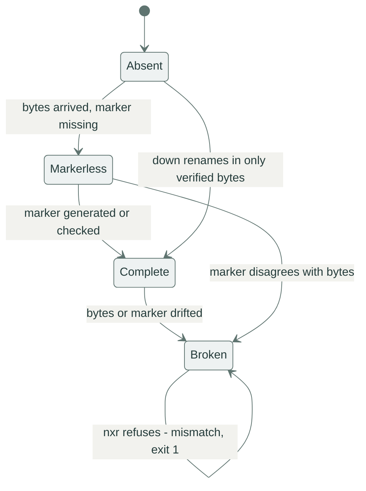

# When it breaks

Every failure has a name, an exit code and a hint.
Find yours in the tables, fix the cause, repeat the command: `up` skips finished names and `down` resumes from part files by default.

## Anatomy of a failure

```console
$ nxr up dist/1.4.0/ https://nexus.example.com/repository/raw-main/1.4.0/
error: mismatch: app-1.4.0.zip: complete on both sides with different digests: local 38e98b1651bd21fdc5da48c407b711947a0115b28a2b979cf637a5497c3720b5, remote 405e28e8bcf3d4a6a1098029dacc54c7ba14d9b08ecf2b3e15c377c0b896636a
hint: the two sides diverge; delete or fix one copy, never let nxr overwrite a diverging object
```

The `error:` line starts with the error kind and names the artifact and both sides of the disagreement.
The `hint:` line names the next check.
The same text travels in the `hint` field of `--json` output.
The process exit code separates data problems from transport trouble.

## Exit codes: cause and fix

| Exit | Kind | Cause | Fix |
|:-----|:-----|:------|:----|
| `0` | ok | transferred, converged or verified | carry on |
| `1` | `mismatch` | two sides disagree about a name's content | nobody overwrites: rebuild, or republish under a new version directory |
| `1` | `incomplete` | local copies unfinished at `verify` | rebuild (the list names the offenders) |
| `1` | `missing` | a requested name exists nowhere | check spelling, the manifest and the version directory |
| `1` | `cannot enumerate` | `down` has no name list | ship `manifest.json`, or pass `--manifest` / `--name` / `--ls` |
| `2` | `unsafe name` | a name fails the grammar | rename the artifact |
| `2` | `misuse` | bad flags, missing directory, half-set credentials | fix the invocation |
| `3` | `auth` | 401/403 or missing credentials | check `NXR_AUTH` / `NXR_USERNAME` + `NXR_PASSWORD`, or pass `-u` |
| `3` | `transport` | network, TLS or stall, with retries exhausted | repeat the command later, resume is free |
| `3` | `http <status>` | an unexpected response | read the status: 404 is a wrong path, 429 is a rate limit |

Full taxonomy with every field: [errors and exit codes](../reference/errors.md).

## The four states of an object

Every name, local or on the server, is in exactly one of four states.
`up` and `down` diff the two sides state by state, and the refusals fall out of the diff:



`Complete` means bytes plus a sibling whose digest matches.
`Markerless` means bytes only: normal mid-transfer, suspicious when a run finished.
`Broken` means bytes and marker disagree, and `nxr` will not fix it by overwriting: the next `up` or `down` refuses with `mismatch` until a human deletes or repairs one side.
`Absent` means no bytes, and a marker without bytes reads as `Absent`.

## Divergent objects are never overwritten

The refusal you will meet most often, with its two faces.

A local file drifted after its marker was written:

```console
$ nxr up dist/1.4.0/ https://nexus.example.com/repository/raw-main/1.4.0/
error: mismatch: pinned.xml: local object is broken and must not be overwritten: digest mismatch: sibling 8eed95dc200589a2b132c182fac5ce9335866b9d2aa0225760ef944bac4b09c5, actual 4925cd5b6a8a02b33a3bd303661d19a84a640c533b32b78229659be743c1d2f6
hint: the two sides diverge; delete or fix one copy, never let nxr overwrite a diverging object
```

The same name holds two different artifacts on the two sides, for example a rebuild published into a version directory that was already used:

```console
$ nxr up dist/1.4.0/ https://nexus.example.com/repository/raw-main/1.4.0/
error: mismatch: app-1.4.0.zip: complete on both sides with different digests: local 38e98b1651bd21fdc5da48c407b711947a0115b28a2b979cf637a5497c3720b5, remote 405e28e8bcf3d4a6a1098029dacc54c7ba14d9b08ecf2b3e15c377c0b896636a
hint: the two sides diverge; delete or fix one copy, never let nxr overwrite a diverging object
```

Exit 1 in both cases, and nothing was sent.
The way out is a decision, not a flag: rebuild and fix the local copy, or publish the new content under a new version directory and move the channel.

## Interrupted transfers

Kill a `get` mid-flight (`timeout` here stands in for `Ctrl-C`) and the bytes so far live in a part file next to the target:

```console
$ timeout 4 nxr get https://nexus.example.com/repository/raw-main/1.4.0/app-1.4.0.zip -o app.zip
$ echo $?
124
$ ls -A | grep app.zip
app.zip.part
```

Nothing partial ever hides under the real name.
Repeat the command with `--continue` and the transfer resumes through a `Range: bytes=N-` request instead of starting over:

```console
$ nxr get https://nexus.example.com/repository/raw-main/1.4.0/app-1.4.0.zip -o app.zip --continue
get: 98304 bytes → app.zip (resumed from 32768)
```

The `(resumed from …)` figure is the part-file size the server was asked to continue from.
For a whole directory the same story runs through `down`: rerunning the command resumes its part files by default (see [break it on purpose](../get-started.md#break-it-on-purpose) for the part-file anatomy).

A killed `up` leaves the server with whatever completed: some names `Complete`, the name in flight `Markerless` or `Absent`.
Repeat the same command and the diff re-sends exactly the unfinished names.
Here someone crashed earlier: the archive is on the server, its marker is not:

```console
$ curl -sT dist/1.4.0/app-1.4.0.zip https://nexus.example.com/repository/raw-main/half/1.0.0/app-1.4.0.zip -w '%{http_code}\n'
201
$ nxr up dist/1.4.0/ https://nexus.example.com/repository/raw-main/half/1.0.0/
plan: 4 to upload, 0 to download, 0 up to date
↑ pinned.xml ok
↑ bom/linux-x86_64.json ok
↑ manifest.json ok
↑ app-1.4.0.zip ok
uploaded 4, downloaded 0, skipped 0
```

The pre-existing bytes are not skipped as good enough: a `Markerless` remote name is re-sent complete with its marker, because an unverifiable object is not done.

## `down` refuses with "cannot enumerate"

Nexus raw has no guaranteed listing, and `down` refuses to guess:

```console
$ nxr down https://nexus.example.com/repository/raw-main/1.3.0/ vendor/old/
error: cannot enumerate: https://nexus.example.com/repository/raw-main/1.3.0/: no manifest.json on the server and no --manifest/--name/--ls given
hint: pass --manifest <file|url|->, repeat --name, or use --ls when the server has the search API
```

Three ways out, in order of preference:

1. publish a `manifest.json` into the version directory (see [ship a manifest for consumers](publish.md#ship-a-manifest-for-consumers)), and plain `nxr down <ver-url>/ dst/` works.
2. pass the names: `--manifest <file|url|->` or repeatable `--name`.
3. `--ls` for a best-effort walk through the server search API, which depends on the server release.

The decision table for picking one: [choosing an enumeration source](consume.md#choosing-an-enumeration-source).

## Auth failures

Wrong or missing credentials surface as `auth`, exit 3, before anything transfers:

```console
$ nxr -u deployer:wrong-horse up dist/1.4.0/ https://nexus.example.com/repository/raw-main/1.4.0/
error: auth: https://nexus.example.com/repository/raw-main/1.4.0/app-1.4.0.zip: HTTP 401 Unauthorized; pass -u user:pass or export NXR_AUTH (base64 user:pass)
hint: pass -u user:pass or export NXR_AUTH (base64 user:pass)
```

The named object varies: the 401 lands on whichever status probe arrives first.
`nxr doctor <url>` separates no credentials from rejected credentials without printing secrets (see [check the setup before the run](ci.md#check-the-setup-before-the-run)).

## Transport trouble

Connection resets, stalls and timeouts exhaust `--retry` attempts and end as `transport`, exit 3.
A connection reset, with retries disabled to make it visible:

```console
$ nxr --retry 1 down https://nexus.example.com/repository/raw-main/1.4.0/ vendor/drop/
error: transport: https://nexus.example.com/repository/raw-main/1.4.0/manifest.json: error sending request for url (https://nexus.example.com/repository/raw-main/1.4.0/manifest.json)
hint: check the network; transfers are resumable, rerunning is safe
```

With the default `--retry 4` the same blips are absorbed and surface as `retrying` events under `--json` (see [NDJSON events](ci.md#ndjson-events)).
Repeat the command when you see exit 3: finished names are skipped, part files resume, nothing starts from zero.

## Unsafe names

Names are rejected before any request when they fail the grammar:

```console
$ nxr down https://nexus.example.com/repository/raw-main/1.4.0/ vendor/evil/ --name '../etc/passwd'
error: unsafe name: ../etc/passwd: each segment must match [A-Za-z0-9._-]+, be 1..=255 bytes, and not be '.' or '..'
hint: names must be relative paths of [A-Za-z0-9._-] segments; the .sha256 suffix is reserved
```

```console
$ nxr down https://nexus.example.com/repository/raw-main/1.4.0/ vendor/evil/ --name 'app-1.4.0.zip.sha256'
error: unsafe name: app-1.4.0.zip.sha256: reserved suffix .sha256 (artifact/marker collision)
hint: names must be relative paths of [A-Za-z0-9._-] segments; the .sha256 suffix is reserved
```

Exit 2 in both cases: path traversal is impossible by construction, and an artifact can never collide with its own marker.

## TLS problems

Certificate verification is on by default.
`--tls-insecure` switches it off per call, for a test server with a self-signed certificate, and `nxr doctor` reports the choice loudly:

```console
$ nxr --tls-insecure -u deployer:pw doctor http://127.0.0.1:8734/1.4.0/manifest.json
doctor:
  [  ok  ] credentials: resolved from -u flag
  [ FAIL ] tls: verification is OFF (--tls-insecure); fine for a local mock, dangerous beyond it
  [  ok  ] settings: workers 8, retry 4, stall 30s, connect 15s
  [  ok  ] probe: HEAD http://127.0.0.1:8734/1.4.0/manifest.json → HTTP 200
error: misuse: 1 check(s) failed
hint: check the command line arguments
```

## Debugging aids

- `nxr doctor [URL]`: credentials, TLS, settings, reachability, without printing secrets.
- `-v`: transfer starts, plan names, retry attempts with reasons.
- `--json`: every event as NDJSON, ready to pipe to `jq`.

The repository ships a mock server that replays failure modes deterministically, so you can rehearse all of the above offline:

| Scenario | Behavior | Rehearse |
|:---------|:---------|:---------|
| `atomic` | straight-through storage: every fully-read request is served normally | the happy paths |
| `partial-put` | first PUT per path cut mid-body, nothing stored | interrupted `up` |
| `drop-connection` | first request per path answered with a TCP reset | transport errors and retries |
| `freeze-upload` | PUT connections held after the head: body never read, no answer | upload stall detection |
| `sizeless` | success GET/HEAD answers carry no `Content-Length` (the proxy case) | clients that read sizeless objects |
| `slow` | GET/HEAD bodies drip in `--chunk-size` pieces, `--chunk-delay-ms` apart | stall detection, kill-and-resume |
| `foreign-marker` | stored markers get their digest replaced by 64 zeros | divergence detection |
| `markerless` | markers acknowledged but never stored | the `Markerless` repair path |
| `auth-401` | every request needs Basic auth (default `ci:secret`) | auth failures |
| `doc-drift` | atomic until drift is switched on in the library API, then every `version.json` GET serves a ghost artifact | the conformance suites |
| `flaky` | the first `--flaky K` requests per path answer 503 (default 2) | retry behavior |

```bash
target/debug/mock-nexus drop-connection --port 8080
target/debug/mock-nexus slow --chunk-delay-ms 2000 --port 8080
```

The full scenario table: [conformance](../explanation/conformance.md).

## Next steps

- The producer's view of the same refusals: [publish a version](publish.md).
- The consumer's recovery path: [consume artifacts](consume.md).
- Every error variant and its JSON shape: [errors and exit codes](../reference/errors.md).
