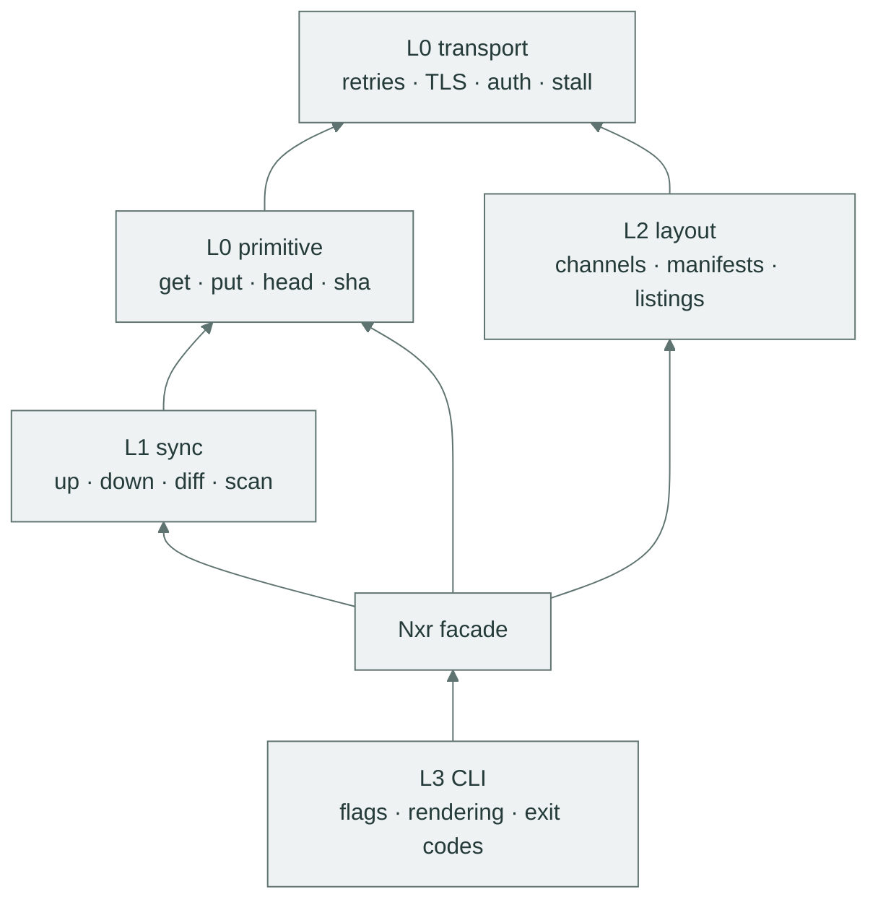

# Rust API

`nexus-raw-core` is the protocol without a UI: the operations of the CLI as a small async API around one facade.
The crate is organized in layers, the CLI is a thin shell over the top layer, and every layer below it is public API: you can embed just the transport, just the transfer engine, or the whole facade.
The exhaustive type-level documentation lives in the crate docs (`cargo doc -p nexus-raw-core --open`, or the crate's page on docs.rs once published).
This page is the guided tour.

## Layers

| Layer | Modules | Content | Depends on |
|:------|:--------|:--------|:-----------|
| L0 · transport | `transport` | one client: retries, backoff, stall detection, TLS, auth, Range-resume | nothing above |
| L0 · primitive | `primitive` | `get`/`put`/`head`/`sha`: curl-grade, no verification | transport |
| L1 · transfer | `sync` | directory up/down, the symmetric diff, sha-sibling markers, parallel workers | transport, primitive |
| L2 · layout | `layout` | channels (token files with any name), manifests, search-based listings | transport |
| facade | `nxr` | `Nxr`, the single entry point that threads everything together | all of the above |
| L3 · UX | the CLI crate | doctor, hints, human and NDJSON rendering, exit codes | the facade |

The rule is one-directional: layers never import upward.
The facade and the layering, as the crate itself draws it:



## Add the dependency

```toml
[dependencies]
nexus-raw-core = { path = "crates/nexus-raw-core" }   # inside this workspace
# or, once published:
# nexus-raw-core = "0.3"
```

## The facade

`Nxr` is the single entry point.
It is built from a `Config` (one invocation's settings, no config file) and an event channel it emits progress into.

```rust
use std::time::Duration;
use nexus_raw_core::{Config, Nxr, Event};

let (tx, mut rx) = tokio::sync::mpsc::unbounded_channel::<Event>();

// Drain events while the operation runs (or after, from the buffered queue).
let renderer = tokio::spawn(async move {
    while let Some(ev) = rx.recv().await {
        println!("{}", ev.to_json());
    }
});

let nxr = Nxr::new(
    Config {
        base: "https://nexus.example.com/repository/raw-main/1.4.0/".into(),
        tls_insecure: false,
        workers: 8,
        retry_attempts: 4,
        connect_timeout: Duration::from_secs(15),
        stall_timeout: Duration::from_secs(30),
        auth: Some("Basic Y2ktYm90OnRva2Vu".into()), // resolved from -u or env by callers
    },
    tx,
)?;
```

`Config::base` is the directory URL this invocation works on, normalized to a trailing `/`.
`auth` is the ready `Authorization` header value. Build it from `-u user:pass`, `NXR_AUTH` (base64 `user:pass`) or `NXR_USERNAME` + `NXR_PASSWORD`, exactly as the CLI does.
`creds::resolve` does this for you.
`Config::validate` enforces the sane ranges the CLI flags map onto: workers in `1..=64`, positive timeouts.

A complete, self-contained round trip (publish a directory against a scratch server and fetch it back) is `cargo run -p nexus-raw-core --example publish`.
It starts its own mock server, so the example runs with zero setup, and its shape (build config → open channel → `up` → `down` → drop facade → join renderer) is the intended embedding pattern.

## Operations

Every method mirrors a CLI command one-to-one.

| Method | Returns | Mirrors | Contract |
|:--------|:--------|:--------|:---------|
| `get(url, out, cont)` | `GetOutcome` | `nxr get` | stream a URL to a file or stdout, resume through `<out>.part` |
| `put(url, src, sha)` | `(u64, Option<Digest>)` | `nxr put` | PUT a file, optionally with its sha-sibling |
| `head(url)` | `HeadInfo` | `nxr head` | status and metadata: 404 is a normal result, not an error |
| `sha(src)` | `Digest` | `nxr sha` | stream a `ShaSource::File` or `ShaSource::Url` through sha256 |
| `scan(dir)` | `Vec<ArtifactName>` | the `up` input set | the plain-mode local listing `up` starts from |
| `diff(dir, names, mode, markers)` | `Vec<Action>` | `up --dry-run` | the symmetric plan without transferring |
| `up(dir, names, gen_markers, claim, plan)` | `Summary` | `nxr up` | verified upload: bytes, then the marker of the same name |
| `down(dst, enum_src, fresh, plan)` | `Summary` | `nxr down` | verified download: the enumeration source is mandatory |
| `verify(dir, names)` | `Summary` | `nxr verify` | offline bytes+marker+digest check, emits only the summary |
| `channel_get(url)` | `Option<String>` | `nxr channel get` | `None` on 404 |
| `channel_set(url, token, if_forward)` | `ChannelOutcome` | `nxr channel set` | `Written { from }` or `Skipped { current }` |
| `manifest_at_base()` | `Option<Manifest>` | `down`'s default | the `manifest.json` convention at the facade's base |
| `manifest_from(url)` | `Manifest` | `--manifest <url>` | fetch and parse a manifest from an arbitrary URL |
| `ls_versions()` | `Vec<String>` | `nxr ls` | search-API traversal, experimental |
| `ls_assets()` | `Vec<ArtifactName>` | `nxr ls --assets` | search-API traversal, experimental |

Two parameters deserve their one-liners:

- `names: Option<Vec<ArtifactName>>` restricts a transfer to a manifest's names.
`None` scans the directory.
- `plan: Option<Vec<Action>>` accepts a precomputed diff: print the plan, then execute exactly it.

Failures collect per name into `Summary.failed` while the rest of the transfer completes.
Refusals (`Verdict`) abort before any byte moves and convert into `Error` (see [errors](#errors)).

## L0: transport and primitives

The client owns every cross-cutting concern so that no other layer repeats them: retry policy with backoff and jitter, connect timeout, stall abort, TLS mode, the `Authorization` header, and the Range-resume download.

```rust
use std::time::Duration;
use nexus_raw_core::{Config, Event};
use nexus_raw_core::transport::client::NexusClient;

let cfg = Config {
    base: "https://nexus.example.com/repository/raw-main/".into(),
    tls_insecure: false,
    workers: 8,
    retry_attempts: 4,
    connect_timeout: Duration::from_secs(15),
    stall_timeout: Duration::from_secs(30),
    auth: Some("Basic Y2ktYm90OnRva2Vu".into()),
};
let (tx, _rx) = tokio::sync::mpsc::unbounded_channel::<Event>();
let client = NexusClient::new(&cfg, nexus_raw_core::Progress::new(tx))?;
// `client` is shared behind an Arc by the facade; every request it makes
// retries, stalls and authenticates by exactly the policy configured above.
```

The primitive layer is four functions over that client.
`sha` of a local file never touches the network, which makes it the offline smoke test of choice:

```rust
use nexus_raw_core::{Digest, Nxr, ShaSource};

async fn local_digest(nxr: &Nxr, path: &str) -> Result<Digest, nexus_raw_core::Error> {
    // No request is made for a File source.
    nxr.sha(ShaSource::File(path.into())).await
}
```

`GetOutcome` carries `size`, the `digest` of the written file (stdout mode skips hashing and returns `None`), and `resumed_from`, the part offset the transfer continued from (`0` for a fresh download).

## L1: transfer

`sync` classifies, then executes.
`scan` and `local_statuses` are pure filesystem work, `classify` is a pure function from local and remote states to a plan, and `up`/`down` execute a plan with the worker pool.

```rust
use nexus_raw_core::Nxr;

fn what_would_up_scan(nxr: &Nxr) -> Result<(), nexus_raw_core::Error> {
    // Pure local listing: the names `up` would consider, grammar-checked.
    let names = nxr.scan("dist/1.4.0".as_ref())?;
    println!("would consider {} names", names.len());
    Ok(())
}
```

An `Action` is one name's line of a plan and has exactly three shapes: `Upload { name, size, digest }`, `Download { name, size, digest }` and `Skip { name, digest }`.
`Mode::Up` and `Mode::Down` select which side wins a single-completed-copy name, per the [symmetric diff matrix](protocol.md#the-symmetric-diff).
The digest inside an `Upload` action is present only when markers are enabled. Knowing the digest and writing the marker are separate concerns.

## L2: layout

`layout` reads and writes the conventional objects: channel refs, manifests, and search-based listings.
Manifest parsing is pure and offline:

```rust
use nexus_raw_core::Manifest;

fn parse_manifest(bytes: &[u8]) -> Result<(), nexus_raw_core::Error> {
    let manifest = Manifest::from_slice(bytes)?;
    for name in &manifest.names {
        println!("{}", name);
    }
    Ok(())
}
```

`Manifest::from_slice` tolerates the claim-shaped fields (`claim_version` must be `1` when present, `version` is ignored), drops duplicates and grammar-checks every name, the exact rules the [protocol page](protocol.md#manifest) documents.
`channel_set` returns `ChannelOutcome::Written { from }` or `ChannelOutcome::Skipped { current }`, where the forward-only guard compares tokens in dotted-numeric order.

## Enumeration

`down` refuses to guess what to fetch, so the facade takes an explicit source. The variants mirror the CLI's enumeration flags:

| Variant | CLI flag | Semantics |
|:--------|:---------|:----------|
| `Enumeration::Manifest(Manifest)` | `--manifest <file\|url|->` | exact: the parsed name list |
| `Enumeration::Names(Vec<ArtifactName>)` | `--name` (repeatable) | exact: every name grammar-checked at parse time |
| `Enumeration::Search` | `--ls` | best-effort: walks the server search API with continuation tokens |

An enumeration that produces zero names refuses with `Enumerate`, because an empty plan is treated as a wrong URL rather than as success.

## Events

`Event` is the progress stream, one channel the facade emits into.
The NDJSON shapes are fixed by golden tests, and `Event::to_json()` is the single serializer, so an embedding UI and the CLI output cannot diverge.

| Variant | Fires | NDJSON shape |
|:--------|:------|:-------------|
| `Plan { upload, download, skip }` | once per transfer, before execution | `{"event":"plan","upload":["a.zip"],"download":[],"skip":[]}` |
| `ArtifactStarted { name, dir, total }` | when a name begins moving | `{"event":"artifact","name":"a.zip","state":"uploading","done":0,"total":38}` |
| `ArtifactBytes { name, dir, done, total }` | coalesced: at most one per 200 ms per name | `{"event":"artifact","name":"a.zip","state":"downloading","done":12,"total":38}` |
| `ArtifactDone { name, dir, skipped, done, total }` | when a name settles | `{"event":"artifact","name":"a.zip","state":"done","done":38,"total":38}` |
| `Retrying { name, attempt, reason }` | before each replayed attempt | `{"event":"retrying","name":"a.zip","attempt":2,"reason":"transport: …: HTTP 503"}` |
| `Summary(Summary)` | last event of every transfer | `{"event":"summary","uploaded":1,"downloaded":0,"skipped":2,"failed":[]}` |

`dir` renders as the state prefix: `Dir::Up` → `"uploading"`, `Dir::Down` → `"downloading"`.
`ArtifactDone` reuses the same `artifact` event with the final state: `"done"`, or `"skipped"` when the diff found nothing to move.
`total` is `null` when the server advertises no `Content-Length`.

A real stream, captured by `down --name app.zip --json`:

```json
{"download":["app.zip"],"event":"plan","skip":[],"upload":[]}
{"done":0,"event":"artifact","name":"app.zip","state":"downloading","total":38}
{"done":38,"event":"artifact","name":"app.zip","state":"downloading","total":38}
{"done":38,"event":"artifact","name":"app.zip","state":"done","total":38}
{"downloaded":1,"event":"summary","failed":[],"skipped":0,"uploaded":0}
```

Simple commands print their final object instead of a stream: `get` → `{"bytes":…,"ok":true,"out":…,"resumed_from":…,"sha256":…,"url":…}`, `put` → `{"bytes":…,"marker":…,"ok":true,"url":…}`, `head` → `{"content_type":…,"size":…,"status":…,"url":…}`, `channel set` → `{"from":…,"outcome":"written","token":…,"url":…}`.
The [CLI output section](cli.md#output) shows where each shape appears.

## Errors

`nexus_raw_core::Error` is the whole taxonomy: `Mismatch`, `Incomplete`, `UnsafeName`, `Missing`, `Enumerate`, `Auth`, `Transport`, `Http`, `Misuse`.
`Error::exit_code()` maps it to the CLI's exit classes and `Error::hint()` returns the human hint. Both are covered variant by variant in [errors and exit codes](errors.md).
`Verdict` (diff refusals: `Mismatch`, `Missing`, `LocalIncomplete`) converts into `Error` with `From`, so a refused plan and a refused transfer look identical to a caller.

## Node bindings

The same surface ships to Node as promises: the `nexus-raw-napi` crate wraps the `Nxr` facade one-to-one, and the npm package name is `nexus-raw`.
Every command is one self-sufficient call — the URL in argv, credentials in the `auth` option or the environment, no config file — and each promise resolves to the command's result or rejects with an `Error` carrying `exitCode` and `hint`.
An optional `onEvent` callback receives the JSON-parsed [`Event`](#events) objects, and a transfer promise resolves to the final summary.

```js
import { up, down } from 'nexus-raw'

const summary = await up('dist/1.4.0', 'https://nexus.example.com/repository/raw-main/1.4.0/', {
  claimFirst: 'claim.json',
  onEvent: (event) => console.log(event),
})
```

The crate is built on napi-rs 3: async exports run on its built-in tokio runtime, the build scripts come from the `@napi-rs/cli`, and `linux-x86_64-gnu` is the wired prebuilt target.
The typed declarations live in `crates/nexus-raw-napi/index.d.ts`, and `crates/nexus-raw-napi/smoke.mjs` is the runnable offline check of the built addon.

## Guarantees

- No protocol logic outside the crate: the CLI is flags and rendering only.
- Credentials never appear in `Event`s, error messages or `Display` impls.
- Markers, the write order, the classification and resume follow [the wire protocol](protocol.md) exactly, and any divergence is a bug.
