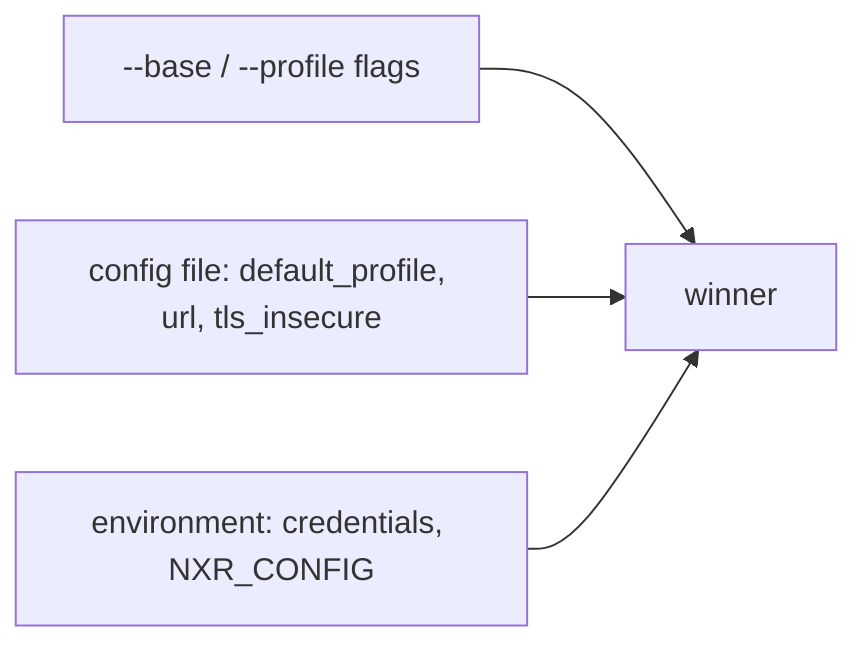

# Config and credentials

Everything `nxr` reads besides its flags: one TOML file and four environment variables.

## File location

| How | Path |
|:----|:-----|
| explicit | `--config /path/to/config.toml` |
| environment | `$NXR_CONFIG` |
| XDG default | `$XDG_CONFIG_HOME/nxr/config.toml`, else `~/.config/nxr/config.toml` |
| opt out | `--no-config` |

An explicit path or `$NXR_CONFIG` that does not exist is an error; the XDG default may be absent.

## Keys

```toml
--8<-- "docs/snippets/config.toml"
```

| Key | Where | Meaning |
|:----|:------|:--------|
| `default_profile` | top level | profile used when no `--profile` is given |
| `url` | profile | the repository base URL, required |
| `tls_insecure` | profile | skip certificate verification, default `false` |

Unknown keys are refused; `auth` and `password` keys are refused with an explicit message — credentials never live in the config.

## Environment

| Variable | Meaning |
|:---------|:--------|
| `NXR_<PROFILE>_AUTH` | `Basic` credential for one profile: base64 `user:pass` |
| `NXR_AUTH` | the same, for every profile |
| `NXR_USERNAME` + `NXR_PASSWORD` | the readable pair; encoded on the fly |
| `NXR_CONFIG` | config file path |

Resolution order: per-profile `AUTH`, then global `AUTH`, then the username/password pair.
The first chain that yields a credential wins; a half-set pair is an error.

```bash
printf '%s:%s' ci-bot "$TOKEN" | base64     # -> NXR_MAIN_AUTH
```

## Precedence



- the base URL: `--base`, else the selected profile's `url`, else `default_profile`'s;
- `tls_insecure`: the flag ORs with the profile's value;
- credentials: env only, selected by the profile name when present.

## A minimal setup

```toml
[main]
url = "https://nexus.example.com/repository/raw-main/"
```

```bash
export NXR_MAIN_AUTH="$(printf 'ci-bot:%s' "$TOKEN" | base64)"
nxr up --profile main --dir dist/1.4.0
```
